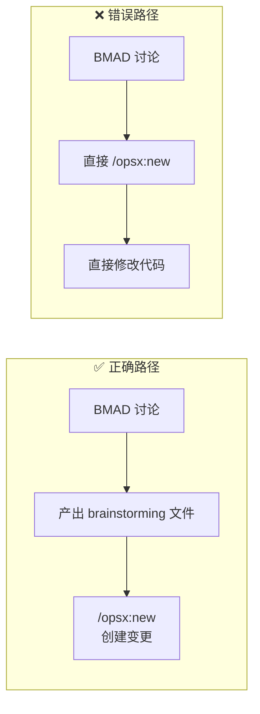
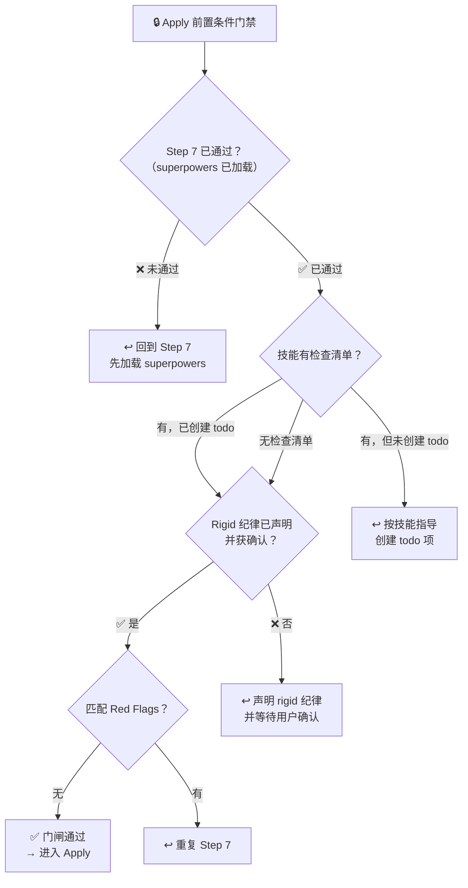
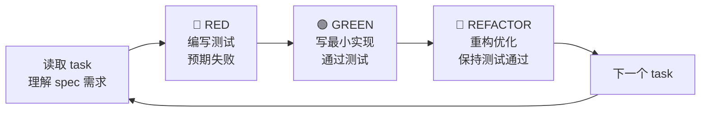
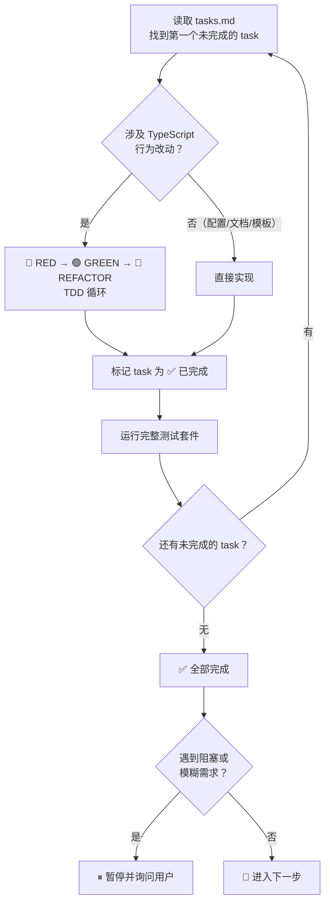

# DeepStorm Flow — 端到端开发工作流

DeepStorm Flow 是 DeepStorm 插件开发的标准操作流程，覆盖从需求讨论到归档的完整链路：

```
BMAD 需求讨论 → /opsx:new 创建变更 → proposal → specs → design → tasks → 检查 superpowers → TDD apply → verify → archive
```

---

## ⚠️ 第一原则：严格按步执行，不可跳步

**这是本 skill 最重要的一条规则，请全文阅读后再行动。**

DeepStorm Flow 是一个有向无环图——每一步的产出是下一步的输入。跳步等于不知道自己在做什么：

| 跳步行为 | 后果 |
|---------|------|
| BMAD 讨论完直接写代码 | ❌ **本 session 发生的错误**。跳过 OpenSpec → 没有规范文档 → 无法验证 → 无法归档 |
| tasks 写完直接 /opsx:apply | ❌ 跳过 superpowers 检查 → 可能遗漏关键 skill 指导 |
| 不写 spec 直接写代码 | ❌ 没有 WHEN/THEN 约束 → 测试不知道测什么 |

> **🚫 任何时候，如果你发现自己想"先做一步，再回头补文档"，立即停下来。** 这个想法是最大的 red flag。文档不是事后补的，是事前想的。

**补救规则：** 如果发现已经跳步（如本 session），必须先停下当前工作，补全所有跳过的 artifacts，然后才能继续。**不得以"代码已经写了"为由跳过文档产出。**

---

## 核心原则

- **每个 OpenSpec change 在一个独立 Claude Code 会话中完成**
- **简单变更可跳过 BMAD，直接从 OpenSpec 开始**
- **严格按照 artifact 依赖顺序产出，不可跳步。跳步 = 违规，没有例外**
- **产出规范时专注"这是什么"，实现时专注"怎么做"**
- **实现阶段必须使用 TDD（Red-Green-Refactor）：先写测试，再写实现，后重构**，这是不可协商的纪律
- **实现前先检查 superpowers**：调用 Skill 工具检查是否有适用于当前任务的技能，技能优先级高于默认行为

---

## 工作流总览

```mermaid
flowchart LR
    BMAD["1. BMAD 需求讨论<br>（可选）"] --> NEW["2. /opsx:new<br>创建变更"]
    NEW --> PROPOSAL["3. proposal"]
    PROPOSAL --> SPECS["4. specs"]
    SPECS --> DESIGN["5. design"]
    DESIGN --> TASKS["6. tasks"]
    TASKS --> SUPER["7. 检查 superpowers"]
    SUPER --> APPLY["8. TDD-Apply<br>实现"]
    APPLY --> VERIFY["9. /opsx:verify<br>验证"]
    VERIFY --> ARCHIVE["10. /opsx:archive<br>归档"]

    style SUPER fill:#e1d5e7,stroke:#9673a6
    style APPLY fill:#d5e7d5,stroke:#739673
```



> ## 🚨 入口门禁：用户消息 → 步骤路由（每次进入本 skill 必须执行）
>
> **本 skill 加载完毕后的第一句回复**——在回答用户消息之前，必须先声明 `📍 当前步骤`，然后**根据用户消息的性质路由到对应的流程步骤**。
>
> ```mermaid
> flowchart TD
>     MSG["📍 用户消息到达"] --> TYPE{"消息属于什么性质？"}
>     TYPE -->|"需求/想法/待办/改进"| R1["→ Step 1: BMAD 讨论<br>或 Step 2: /opsx:new"]
>     TYPE -->|"已打开的 change 指令"| R2["→ 当前 change 的下一步骤"]
>     TYPE -->|"要求直接改代码"| R3["🚫 拒绝<br>必须先走 OpenSpec"]
>     TYPE -->|"归档/验证/状态查询"| R4["→ Step 9: 验证<br>或 Step 10: 归档<br>或 /opsx:explore"]
> ```
>
> ### 三条铁律
>
> 1. **需求必须过 OpenSpec** — 不得以"用户要求了"、"时间紧"、"很简单"为由跳过。
> 2. **代码改动必须先有 tasks + superpowers** — 引导走 OpenSpec，不直接改代码。
> 3. **"先改再看"本身就是跳步信号** — 无论以什么名义，涉及代码改动必过 OpenSpec。
>
> ---

## 步骤追踪

每次进入本 skill 后，在第一句回复中声明当前步骤编号。例如：

```
> 📍 当前：Step 2 — 准备创建 OpenSpec change
```

这确保每次上下文窗口刷新后，你仍然知道自己处于流程的哪个位置。

---

## 语言规范

DeepStorm 开发统一遵循 **中文正文 + 英文专有名词** 原则：

| 组件 | 使用中文 | 保留英文原文 |
|------|---------|-------------|
| SDD 文档（proposal/specs/design/tasks） | 正文、场景描述、WHEN/THEN 描述 | 代码实体名、字段名、类名、枚举值、API 路径、技术术语 |
| 代码注释 | 注释正文 | 专有名词（Signal、DTO、MapStruct、PrimeNG 等） |
| 提交信息 | 描述性 message | JIRA URL、PRD 链接、技术术语 |
| 变更名/分支名 | 输入为中文 | 输出为 `{prefix}`/英文 kebab-case（3-6 词），如 `feat/add-user-auth` |

### 分支名前缀参考

所有 DeepStorm 新分支**必须**使用以下 Conventional Commit 类型前缀：

| 前缀 | 用途 | 说明 |
|------|------|------|
| `feat/` | 新功能 | 用户可见的新特性 |
| `fix/` | Bug 修复 | 缺陷修复 |
| `chore/` | 日常维护 | 配置、工具链、依赖更新 |
| `refactor/` | 代码重构 | 不改变行为的代码结构调整 |
| `docs/` | 文档 | 文档变更 |
| `test/` | 测试 | 测试新增或修改 |
| `perf/` | 性能优化 | 性能相关的改动 |
| `style/` | 代码格式 | 格式化、空格、分号等 |

**前缀选择原则：** 选择最能反映变更**主要意图**的前缀。一个变更可能同时涉及多个类型（如重构+文档），此时取最主要的意图。避免使用 `chore/` 作为"不确定时的默认值"。

## 前置条件

确保环境已正确配置（参见 `docs/deepstorm-development.md` 环境搭建章节）：

- [ ] `pnpm install` 完成
- [ ] `npx bmad-method install` 完成（如需要进行 BMAD 讨论）
- [ ] 当前开发的 DeepStorm 插件已注册（开发 DeepStorm 自身时只需注册正在开发的插件，不需全部注册）
- [ ] `.gitignore` 已正确配置（`_bmad/` 忽略，`_bmad-output/` 跟踪）

---

## 详细步骤

### 1. BMAD 需求讨论（可选）

**何时使用：** 需求不明确、需要多角色结构化讨论时。

**命令：**

| 场景 | 命令 |
|------|------|
| 创意发散 | `/bmad-brainstorming` |
| 需求讨论 | `/bmad` 或自然口述需求 |

**产出：** `_bmad-output/brainstorming/brainstorming-session-{date}-{seq}.md`

> **🔴 强制规则：所有需求讨论都必须产出 brainstorming 文件。**
>
> 即使没有使用 `/bmad` 或 `/bmad-brainstorming` 命令，只要发生了实质性需求讨论（无论以什么形式——用户自然口述、你引导提问、或是讨论 PRD 内容），你**必须**在讨论结束后、进入 Step 2 之前，将讨论内容整理为 `_bmad-output/brainstorming/brainstorming-session-{date}-{seq}.md`。
>
> 这是一个不可协商的步骤。不要以"讨论很简单"或"已经知道要做什么"为由跳过。文件中的内容可以是结构化总结——重点是记录"讨论了什么"和"决定了什么"，作为 Step 2 proposal 的输入来源。
>
> **🚫 错误做法（本次的教训）：**
> ```
> 用户: "重构 reef 技能目录结构，具体是..."
> → 讨论完后直接 /opsx:new  ❌ 跳过 brainstorming 产出
> ```
>
> **✅ 正确做法：**
> ```
> 用户: "重构 reef 技能目录结构，具体是..."
> → 整理讨论内容 → 产出 brainstorming 文件 → /opsx:new  ✅
> ```

**检查清单：**
- [ ] 讨论是否已明确"做什么"和"不做什么"
- [ ] 是否已收敛到可执行的变更范围
- [ ] 简单变更可直接跳过本步骤（跳过 = 没有发生任何需求讨论）
- [ ] **如果发生了讨论：是否已产出 `_bmad-output/` 文件的？** 没有产出前 **不得** 进入 Step 2

### ➡️ BMAD 讨论完成后的下一步

**BMAD 讨论完毕不代表可以写代码。** 讨论的目的是明确需求，不是跳过 OpenSpec。



**任何时候用户说"开始"、"动手吧"——第一步是先产出 brainstorming 记录文件（如果讨论了的话），然后 /opsx:new，不是直接写代码。**

---

### 2. OpenSpec 创建变更

**命令：**

```
/opsx:new {kebab-case-change-name}
```

**说明：** 创建一个新的 OpenSpec change。变更名用英文 kebab-case（如 `add-user-auth`、`reef-test-case-skill`）。如不提供参数，系统会引导输入。

**产出：** `openspec/changes/{change-name}/`（空结构）

---

### 3. 创建 Proposal

**命令：**

```
/opsx:continue
```

**产出：** `proposal.md`

**内容：**
- **Why** — 为什么要做？解决什么问题？
- **What Changes** — 具体改什么？（新能力、修改、删除）
- **Capabilities** — 引入哪些新能力？（这决定了后面的 spec 结构）
- **Impact** — 影响范围

> **Capabilities 是关键：** 每个 capability 都会对应一个 spec 文件。命名使用 kebab-case（如 `test-case-generation`）。

**检查清单：**
- [ ] Why 清晰描述了问题/机会
- [ ] What Changes 列出了具体变更点
- [ ] Capabilities 使用了正确的 kebab-case 命名
- [ ] Impact 覆盖了受影响模块

---

### 4. 创建 Specs

**命令：**

```
/opsx:continue
```

**产出：** `specs/{capability-name}/spec.md`

每个 capability 对应一个 spec 文件，使用 `## ADDED Requirements` 结构：

```
## ADDED Requirements

### Requirement: {需求名称}
{描述文字，使用 SHALL/MUST 表达规范}

#### Scenario: {场景名称}
- **WHEN** {触发条件}
- **THEN** {预期结果}
```

**规范：**
- 每个 Requirement 至少包含一个 Scenario
- Scenario 使用 WHEN/THEN 格式
- 每条 requirment 使用 SHALL/MUST 表达规范性约束
- Scenario 使用 `####` 四级标题
- **语言：** WHEN/THEN 描述使用中文；代码实体名、字段名等技术术语保留英文（参见上方「语言规范」章节）

**检查清单：**
- [ ] 每个 capability 都有对应的 spec 文件
- [ ] 每个 Requirement 都有至少一个 Scenario
- [ ] Scenario 覆盖了正常路径和异常路径
- [ ] 使用 SHALL/MUST 而非 should/may

---

### 5. 创建 Design

**命令：**

```
/opsx:continue
```

**产出：** `design.md`

**内容：**
- **Context** — 背景和现状
- **Goals / Non-Goals** — 目标与明确不做的范围
- **Decisions** — 关键决策及理由（"为什么选 X 而不是 Y"）
- **Risks / Trade-offs** — 已知风险和权衡

**检查清单：**
- [ ] 关键技术决策有备选方案对比
- [ ] Non-Goals 列出了明确排除的范围
- [ ] 风险有缓解措施

---

### 6. 创建 Tasks

**命令：**

```
/opsx:continue
```

**产出：** `tasks.md`

**格式：** 按 `## {N}. 分组名称` 组织，每组下使用 `- [ ]` checkbox：

```
## 1. Setup

- [ ] 1.1 创建目录结构
- [ ] 1.2 创建配置文件

## 2. Core Implementation

- [ ] 2.1 实现核心逻辑
```

**原则：**
- 分组按依赖顺序排列
- 每个 task 可在一个 session 内完成
- 每个 task 完成后可验证

---

### 7. 检查 Superpowers — 实现前的硬性门禁

**命令：**
```
Skill tool — 自动检查，无需手动输入
```

**强制规则（不可协商）：**

> **Step 6（tasks）全部完成后，必须先执行 Step 7 检查 superpowers，然后才能进入 Step 8（Apply）。不检查直接跳入 Apply 的行为违反工作流纪律，等同于跳步。不要以任何理由跳过本步骤。**

**时机：** `tasks.md` 产出完毕 → **立即在此处停下** → 检查 superpowers → 然后才能推进到 Apply。以下路径是错误的：

```
tasks 完成 → "下一步可以运行 /opsx:apply"          ❌ 错误！跳过了 superpowers
tasks 完成 → 检查 superpowers → /opsx:apply         ✅ 正确
```

**流程：**

1. **评估适用性**：审视 `tasks.md` 的任务范围，判断哪些 superpowers 可能适用于本变更
2. **调用 Skill 工具**：只要有 **1%** 的可能性适用，就**必须**调用 Skill 工具加载技能
3. **遵循技能指导**：如果技能包含检查清单，通过 TaskCreate 创建对应的 todo 项
4. **覆盖默认行为**：已加载的技能中的规则优先于本 SKILL.md 中的通用规则

> **⚠️ 刚性技能（Rigid）优先级高于 Apply 流程**
>
> 已加载的 superpowers 分为两种：
>
> | 类型 | 说明 | 示例 |
> |------|------|------|
> | **Rigid（刚性）** | 铁律不可协商。其每条规则必须严格遵循，**覆盖 `/opsx:apply` 的默认执行指令** | `test-driven-development`、`verification-before-completion` |
> | **Flexible（灵活）** | 提供参考模式和建议，可根据上下文调整 | `writing-skills`、`frontend-design` |
>
> **如果加载了 Rigid 技能，进入 Apply 前必须先做以下声明，并获得用户确认：**
>
> ```
> "我已确认已加载 [rigid-skill-name]。该技能的以下纪律将覆盖 Apply 的默认行为："
>   - [纪律 1：例如"任何生产代码必须先有失败测试"]
>   - [纪律 2]
> ```
>
> **常见违规场景（本 session 的教训）：**
>
> | 场景 | 实际发生的错误 |
> |------|---------------|
> | `opsx:apply` 说"implement tasks"，TDD 说"先写测试" | ❌ 我执行了 `opsx:apply` 的节奏，"先改代码再补测试" |
> | TDD 说"delete it, start over"，我选了"保留代码补测试" | ❌ 没有严格遵循铁律，走了捷径 |
>
> **正确做法：** 两个指令冲突时，rigid superpower 优先。`opsx:apply` 的执行节奏必须嵌入 TDD 的 RED → GREEN → REFACTOR 循环中。

**Rigid 技能声明模板（加载后立即执行）：**

加载完所有 superpowers 后，按以下格式向用户声明：

```
## ✅ Superpowers 门闸通过

### 已加载的技能

| 技能 | 类型 | 对本变更的要求 |
|------|------|---------------|
| test-driven-development | 🔴 **Rigid** | 每个 TypeScript 行为改动必须先写测试、看失败、再写实现 |
| writing-skills | 🟢 Flexible | 提供 SKILL.md 结构规范参考 |

### Rigid 纪律确认

进入 Apply 前，以下 rigid 纪律将覆盖默认实现流程：
- `test-driven-development` 的铁律：**NO PRODUCTION CODE WITHOUT A FAILING TEST FIRST**
- 配置文件和 SKILL.md 模板修改豁免 TDD

用户确认后，才能进入 Step 8 Apply。
```

**声明后等待用户确认。用户未确认前不得进入 Apply。**

**典型场景对照表：**

| 任务类型 | 预期需要检查的技能 |
|---------|-----------------|
| TypeScript 新函数/模块 | `superpowers:test-driven-development` |
| TypeScript 改造已有代码 | `superpowers:test-driven-development` |
| 修改/新建 SKILL.md | `superpowers:writing-skills` |
| 修改/新建 参考文档 | `superpowers:writing-skills` |
| 新包/模块创建 | 项目脚手架相关技能 |
| 前端组件 | `frontend-design` |
| 分布式任务编排 | `superpowers:dispatching-parallel-agents` |

### ⛔ 实现前的安全门闸（GATE）

**`tasks.md` 全部产出完毕后，在建议 `/opsx:apply` 之前，必须先通过以下门闸检查：**

| # | 门闸条件 | ⚠️ 未通过时 |
|---|---------|------------|
| 1 | 🔍 是否已按 Step 7 检查并加载了适用的 superpowers？ | **停止。** 回到 Step 7。不要说"先看一眼 tasks"或"我马上回来检查"。 |
| 2 | ✅ 已加载的技能中是否有检查清单？是否已创建对应的 todo 项？ | **停止。** 按技能指导创建 todo 项。 |
| 3 | 🚨 已加载的 Rigid 技能的纪律是否已向用户声明并获得确认？ | **停止。** 声明 rigid 纪律并等待用户确认。未确认前**不得**进入 Apply。 |
| 4 | 👇 下方「Red Flags」中有没有匹配当前思维模式的？ | **停止。** 重复 Step 7。 |

### 🚩 Red Flags — 你正在绕过 Superpowers 检查

> 以下每一个想法都是一个危险信号。**任何一个出现 → 立即停止 → 回到 Step 7 执行 superpowers 检查。**

| 想法 | 现实 |
|------|------|
| "先看看 apply 的 task 列表再检查" | 顺序是 tasks → superpowers → apply。看了 apply 的内容再回头检查是「先跑再绑鞋带」。 |
| "这个变更很简单，不需要检查" | 1% 的可能性就要检查。省略检查不是在节省时间——是在赌没有遗漏。 |
| "我这次任务记得检查就行" | 本回合的 checks 就要做完。下次是下次。 |
| "我知道有哪些 superpowers，不用加载" | 技能会更新。加载的当前版本才有效。 |
| "我刚检查过了" | 之前可能不是为这个 change 检查的。每个 change 独立检查，不可复用。 |
| "先搞快点，后面再补" | 补 = 不补。不可协商的纪律。 |
| "检查 superpowers 浪费 token" | 漏掉一个技能导致产出质量问题，修复成本远高于检查。 |
| "TDD 技能已加载，但 opsx:apply 的节奏更快，先改代码再补测试" | **TDD 铁律优先于 apply 指令。** 见上方「优先级：Rigid > Apply > 默认流程」。改代码再补 = 不是 TDD。 |
| "已经改了代码，回头补测试也一样达到覆盖效果" | 测试-after 和 TDD 不等价。测试-after 验证的是"代码做了什么"，TDD 验证的是"代码应该做什么"。这是有本质区别的。 |

---

### 8. TDD 实现（Apply）

**命令：**

```
/opsx:apply
```

**🔒 硬性前置条件门禁：**



**未通过后的操作指引（准确描述缺了什么）：**

| 缺少的内容 | 具体操作 |
|-----------|---------|
| 未加载 superpowers | "我跳过了 superpowers 检查。应该先加载适用的技能。" → 调用 Skill 工具 |
| 已加载的技能有检查清单但未创建 todo | "技能要求创建 todo 项" → 按技能指导创建 |
| Rigid 纪律未声明 | "加载了 rigid 技能但未向用户确认纪律。应先声明纪律并获得确认。" |
| 不知道哪些技能适用 | 审视 tasks.md 内容与「典型场景对照表」对照判断 |

> 以上操作完成后，**明确告知用户"已完成 superpowers 检查"**，然后才能进入 Apply 阶段。

**核心原则：** 实现阶段必须遵循 rigid superpower 的纪律。如果已加载 TDD，则 TDD 的铁律（Red → Green → Refactor）是最优先的，不能被 `/opsx:apply` 的默认实现节奏覆盖。当 `opsx:apply` 的指令与 rigid superpower 冲突时，rigid superpower 优先。

#### TDD 循环（每个 task 一个循环）



#### 每步说明

**🔴 RED — 先写测试**
- 根据 spec 的 Scenario 编写单元测试
- 运行测试，确认失败（红）
- 如果测试意外通过了，说明测试写的太弱，需改进
- 不写实现代码

**🟢 GREEN — 最小实现**
- 只写让当前测试通过的最小代码量
- 不提前实现未测试的功能
- 运行测试，确认全绿
- 如果感觉"这段代码还没写完"，那是正常的 — 下一个 task 会覆盖

**🔵 REFACTOR — 保持测试通过的前提下重构**
- 清理重复代码、提取函数、重命名
- 保持测试运行通过
- 不改变行为

#### Apply 主流程

> **⚠️ 进入主流程前，先执行以下对齐步骤，然后才能碰任何代码：**
>
> **如果已加载 TDD（`superpowers:test-driven-development`）：**
> 1. `opsx:apply` 可能会说"implement tasks"或"keep going until done"——但 TDD 的铁律高于它
> 2. 每个涉及 TypeScript 行为改动的 task，第一步永远是 **🔴 RED（写测试）**，不是看实现细节
> 3. 配置文件和 SKILL.md 模板修改可以豁免 TDD
>
> **优先级：** Rigid superpower 的铁律 > `opsx:apply` 的执行指令 > 本 SKILL.md 的默认流程

#### 逐 task 执行



#### 无对应测试框架时的兜底策略

如果项目尚未搭建测试框架（如第一个 task 就是搭建测试框架本身），按以下优先级：

1. 如果测试框架已可用 → 必须用 TDD
2. 如果测试框架不存在 → 先创建测试框架基础设施（非 TDD），然后用 TDD 产出后续代码
3. 纯配置文件、package.json 修改 → 不需要 TDD，直接修改
4. Shell 脚本、markdown 文件 → 不需要 TDD

**判断标准：** 任何非配置、非脚手架的 *.ts/*.js 代码文件，都必须遵循 TDD。

---

### 9. 验证（Verify）

**命令：**

```
/opsx:verify
```

**验证维度：**
| 维度 | 检查内容 |
|------|---------|
| **Completeness** | 任务是否全部完成？spec coverage 是否满足？ |
| **Correctness** | spec requirement 是否已实现？scenario 是否被测试覆盖？ |
| **Coherence** | 设计决策是否被遵循？代码风格是否一致？ |
| **TDD Compliance** | 每个功能性模块是否有对应的测试文件？测试覆盖率是否合理？ |

**输出：** 验证报告（CRITICAL / WARNING / SUGGESTION）

---

### 10. 归档（Archive）

**命令：**

```
/opsx:archive
```

**流程：**
1. 检查 artifact 是否全部完成
2. 检查 task 完成度（如有未完成任务需用户确认）
3. 检查 spec 同步状态
4. 将 change 目录移至 `openspec/changes/archive/{date}-{change-name}/`
5. 确认 spec 已同步到 `openspec/specs/{capability}/`
6. 确认测试全部通过

---

## 快速参考卡片

### 命令速查

| 步骤 | 命令 | 说明 |
|------|------|------|
| 需求讨论 | `/bmad-brainstorming` | 创意发散（可选） |
| 创建变更 | `/opsx:new {name}` | 创建 change 结构 |
| 产出 artifact | `/opsx:continue` | 依次创建：proposal → specs → design → tasks |
| 检查 superpowers | `Skill tool（自动）` | **硬性门禁。tasks 完成后必须先执行此步，然后才能 apply** |
| 实现 | `/opsx:apply` | TDD 模式（Red-Green-Refactor）实现 |
| 验证 | `/opsx:verify` | 三维验证 + TDD 合规检查 |
| 归档 | `/opsx:archive` | 移入归档目录 |

### TDD 循环卡片

```
每个 task（有对应 spec 的）：
  1. 🔴 写测试 → 运行 → 失败（确认）
  2. 🟢 写最小实现 → 运行 → 通过
  3. 🔵 重构 → 运行测试 → 通过
  4. ✅ 更新 tasks.md → 进入下一个 task
```

### 产出物位置

```
openspec/changes/archive/{date}-{change-name}/
├── proposal.md              # Why + What + Capabilities
├── specs/{capability}/      # 每个 capability 一个 spec 文件
│   └── spec.md
├── design.md                # 技术决策
└── tasks.md                 # 任务清单
```
