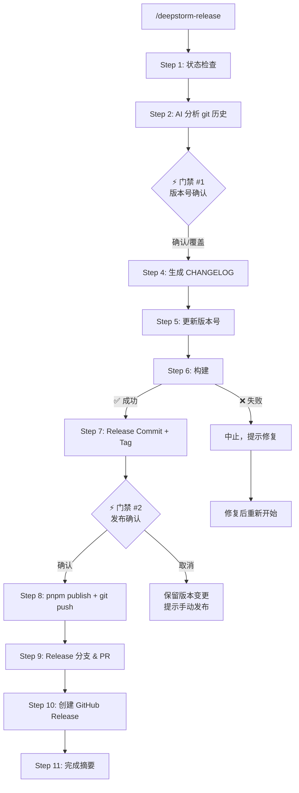

# DeepStorm Release

## Overview

`/deepstorm-release` 是 DeepStorm 项目的 AI 驱动发版流程。它分析 git 提交历史来决定版本号、生成 CHANGELOG、构建代码并发布到 npm——每一步都经过用户确认。

去除了 `changeset` 依赖，改用 Git Log + AI 分析替代手动变更记录。

## When to Use

| 触发场景 | 不适用 |
|------|--------|
| "发版"、"发布"、"release"、"publish"、"bump version" | 日常开发提交 |
| "cut a release"、"ship it" | 独立的 npm 包发布（非 DeepStorm 项目） |
| 准备正式或 pre-release 版本 | 只需要构建而不发布 |

## Version Strategy

- **统一版本号**：所有 `@deepstorm/*` 包共享同一版本号（根 `package.json` 中的 `version`）
- **仅 CLI + Pilot 发布到 npm**：`tide`/`reef`/`sweep`/`atoll` 为 `private: true`，自动跳过发布。`@deepstorm/pilot` 是 CLI 的运行时依赖，必须**先于** CLI 发布。
- **Tag 格式**：`v{version}`（如 `v0.2.0`）

## Workflow



### Step 1: 状态检查

检查当前工作区是否就绪：

```bash
# 获取当前版本
cat package.json | jq -r .version

# 获取最新 tag
git describe --tags --abbrev=0 2>/dev/null || echo "no-tag"

# 检查工作区是否干净
git status --porcelain
```

- **工作区脏** → 列出未提交变更，请用户先提交或 stash，然后重新执行 `/deepstorm-release`
- **无 tag** → 从仓库第一次提交开始分析
- **上次发布以来无新提交** → 提示"自上次发布以来无变更"，退出流程

### Step 2: AI 分析 git 历史

读取自上次 tag 以来的提交记录：

```bash
git log --oneline <last-tag>..HEAD
```

AI 按 Conventional Commits 前缀分类分析变更范围。如果没有 tag，使用 `git log --oneline` 分析全部历史。

**分析维度：**

| 提交类型 | 版本影响 | 示例 |
|---------|---------|------|
| `feat:` | minor | 新功能 |
| `feat!:` 或 `BREAKING CHANGE:` | major | 破坏性 API 变更 |
| `fix:` | patch | Bug 修复 |
| `perf:` | patch | 性能优化 |
| `refactor:` / `docs:` / `test:` / `chore:` | patch | 重构/文档/测试/杂项 |

**产出：** 变更摘要 + **建议版本号**（major / minor / patch，同时检测 pre-release 需求）

### Step 3: 版本号确认 ⚡ 门禁 #1

展示给用户：

```
📋 变更摘要 — v0.1.2 以来的变更

  ✨ Features:      3 (templates, update, doctor)
  🐛 Bug Fixes:     2
  🔧 Maintenance:   1
  ⚠️  Breaking:      0

建议版本: 0.1.2 → 0.2.0 (minor)

确认版本号? (y/n 或输入替代版本号)
```

等待用户操作：
- **y/Y** → 使用建议版本号继续
- **n/N** → 提示用户输入替代版本号，输入后使用该值
- **直接输入版本号** → 使用用户输入的版本
- **用户不回应** → **不要继续，再次询问**

> 版本号遵循 [SemVer](https://semver.org/)。Pre-release 格式如 `0.2.0-beta.1` 或 `0.2.0-rc.1`，此时 pnpm publish 自动使用 `--tag next`。

### Step 4: 生成 CHANGELOG

AI 将 git 提交分类汇总为结构化 CHANGELOG 条目：

```
## [X.Y.Z] - YYYY-MM-DD

### ⚠ BREAKING CHANGES
<!-- 仅在存在破坏性变更时出现此章节 -->

### Features
<!-- feat: 类型的提交 -->

### Bug Fixes
<!-- fix: 类型的提交 -->

### Performance Improvements
<!-- perf: 类型的提交 -->

### Code Refactoring
<!-- refactor: 类型的提交 -->

### Documentation
<!-- docs: 类型的提交 -->

### Maintenance
<!-- chore: / test: / style: / build: / ci: 类型的提交 -->
```

**规则：**
- 每个条目末尾引用 commit hash：`(<abbrev-hash>)`
- 同类且主题相似的多个提交合并为 1-2 句自然语言
- 追加到 `CHANGELOG.md` 已有内容**前面**
- 如果 `CHANGELOG.md` 不存在则新建
- breaking changes 在文件最顶部突出显示
- **只更新根 `CHANGELOG.md`**，子包变更日志已删除，全部由根文件管理（之前独立维护的 `packages/*/CHANGELOG.md` 因严重脱节且套件不独立发布，已统一废弃）

### Step 4.5: 文档完整性检查

在更新版本号之前，检查对外文档是否与本次发布内容一致：

```bash
# 列出本次发布涉及的所有变更文件
git diff --name-only <last-tag>..HEAD
```

**检查清单（LLM 自行推理）：**

1. **CLI 相关变更**（`packages/cli/`）→ 根 `README.md` 的 CLI 命令表、环境变量表、快速开始是否需更新
2. **套件变更**（新增/删除 skill / agent / hook）→ 对应 `packages/*/README.md` 组件列表是否需更新
3. **项目结构变更** → `README.md` 项目结构图和 CLAUDE.md 关键约定是否需更新
4. **MCP/配置变更** → `README.md` MCP 章节、`packages/cli/README.md` 命令表是否需更新

**处理方式：**

列出需更新的文档路径，让用户选择：
- **"立即更新"** → 更新对应文档后继续（文档变更会包含在 release commit 中）
- **"跳过"** → 继续发版流程（不强制，只做记录）

> 此步骤仅作提醒，不阻断发版流程。CHANGELOG 已在 Step 4 中生成，此处重点检查 README 等结构性文档。

### Step 5: 更新版本号

将所有 `package.json` 的 `version` 更新为确认后的版本号：

| 文件 | 操作 |
|------|------|
| `package.json`（根） | `version` 字段写入确认后的版本号 |
| `packages/*/package.json` | `version` 字段同步更新 |

### Step 6: 构建

```bash
pnpm build
```

- **退出码 0（成功）** → 继续
- **退出码非 0（失败）** → 中止流程，展示构建错误信息。版本号变更尚未 commit，不受影响

> **注意：** 构建在 commit 之前执行。如果构建失败，不会产生任何 git 提交。

**构建后验证：** 确认 `dist/registry.json` 的修改时间不早于 `packages/*/wizard.json`：

```bash
ls -l packages/cli/dist/registry.json packages/reef/wizard.json
# dist/registry.json 应比 wizard.json 更新（或同时），否则说明构建未执行
bash -c '[[ packages/cli/dist/registry.json -nt packages/reef/wizard.json ]] && echo "✅ registry 已更新" || echo "❌ dist/registry.json 比源文件旧，请先执行 pnpm build"'
```

### Step 7: Release Commit + Tag

> **⚠️ 前置检查：** 提交前再次确认 `dist/` 已是最新构建产物：
> ```bash
> bash -c '[[ packages/cli/dist/registry.json -nt packages/reef/wizard.json ]] && echo "✅ registry 最新" || echo "❌ 构建已过时！运行 pnpm build 后再提交"'
> ```
> 如果输出 ❌，回到 Step 6 重新构建。

```bash
git add .
git commit -m "chore: 发布 v{version}"
git tag v{version}
```

**Commit Message 格式：** `chore: 发布 v{version}`

### Step 8: npm Publish ⚡ 门禁 #2

展示发布摘要后等待用户确认：

```
📦 即将发布（按依赖顺序）:
   1. @deepstorm/pilot
   2. @deepstorm/cli

   版本: v{version}
   标签: latest

   确认发布? (y/N)
```

流程：

> **先决条件：** 该项目 npm 认证通过 `.env` 中的 `NPM_TOKEN` 环境变量注入 `.npmrc`。沙箱（sandbox）默认无法读取环境变量，
> 以下步骤需要关闭沙箱（`dangerouslyDisableSandbox: true`）或在命令中显式传递 token。

1. **获取 NPM_TOKEN：** 从 `.env` 读取 token：
   ```bash
   grep NPM_TOKEN .env | cut -d'=' -f2-
   ```
   如果 .env 不存在或没有 NPM_TOKEN，提示用户先配置。

2. **跳过重复构建：** Step 6 已执行过 `pnpm build`，使用 `--ignore-scripts` 避免 `prepublishOnly`/`prepack` 重复构建：
   ```bash
   cd packages/cli && pnpm publish --ignore-scripts --no-git-checks --//registry.npmjs.org/:_authToken="$TOKEN"
   ```
   - `--ignore-scripts`：跳过 lifecycle scripts（prepublishOnly / prepack），否则会额外构建两次
   - `--no-git-checks`：跳过 git 状态检查
   - **注意**：使用 `pnpm publish`（非 `npm publish`），pnpm 自动转换 `workspace:^` 为真实版本号
   - `--//registry.npmjs.org/:_authToken=...`：内联传递 token，绕过沙箱 env 限制

3. **用户确认：** 输入 y/Y 才继续。发布时如果用户需要先登录，告知用户运行 `npm login`

4. **git push：** 推送 commit 和 tag 到远程

> **Pre-release 版本：** 使用 `--tag next` 替代 `--tag latest`，如 `0.2.0-beta.1`。用户确认发布时应在摘要中体现标签变化。

**发布顺序（按依赖拓扑）：**

| 顺序 | 包 | 条件 |
|:----:|----|------|
| 1 | `@deepstorm/pilot` | `private: false` — CLI 的运行时依赖，**必须先发布** |
| 2 | `@deepstorm/cli` | 主发布包，依赖 pilot |
| — | `@deepstorm/tide` / `reef` / `sweep` / `atoll` | `private: true`，自动跳过 |

```bash
# Step 8 实际的发布命令（先 pilot，后 CLI）
TOKEN=$(grep NPM_TOKEN .env | cut -d'=' -f2-)
cd packages/pilot && pnpm publish --ignore-scripts --no-git-checks --//registry.npmjs.org/:_authToken="$TOKEN"
cd ../cli && pnpm publish --ignore-scripts --no-git-checks --//registry.npmjs.org/:_authToken="$TOKEN"
```

> **为什么先发布 pilot？** `@deepstorm/cli` 依赖 `@deepstorm/pilot`（`workspace:^` → `^{version}`），如果 pilot 不在 npm 上，用户安装 CLI 时会报 `ETARGET` 错误。

### Step 9: Release 分支 & PR

在 npm 发布和 git push 成功之后，自动创建 release 分支并提交 Pull Request。

> **注意：** 本步骤的失败**不阻断**后续流程。即使是创建分支或 PR 失败，已完成的 pnpm publish 不受影响。

**执行流程：**

1. **创建 release 分支：** 从 `main` 分支创建 `release/v{version}` 并推送到远程
   ```bash
   git branch release/v{version} main
   git push origin release/v{version}
   ```

2. **创建 Pull Request：** 从 `release/v{version}` 向 `main` 提交 PR
   ```bash
   gh pr create \
     --base main \
     --head release/v{version} \
     --title "Release v{version}" \
     --body "$CHANGELOG_CONTENT"
   ```
   - PR 标题格式：`Release v{version}`
   - PR 描述包含本次发布的 CHANGELOG 内容

3. **Auto-merge 启用：**
   ```bash
   gh pr merge --auto --squash --subject "Release v{version}"
   ```
   - 使用 squash merge 策略，保持 main 历史整洁

**异常处理：**

| 异常 | 处理方式 |
|------|---------|
| release 分支已存在 | 提示并跳过，不阻断流程 |
| PR 创建失败 | 输出错误信息，提示用户手动创建 |
| auto-merge 失败 | 输出错误信息，提示用户手动合并 |
| `gh` CLI 不可用 | 提示用户安装 gh CLI 或手动操作 |

### Step 10: 创建 GitHub Release

在 PR 合并完成后，自动在 GitHub 仓库创建对应版本的 Release。

> **注意：** 本步骤的失败**不阻断**后续流程。Release 创建失败不影响已完成的 pnpm publish 和 git push。

**执行流程：**

1. **获取 CHANGELOG 内容：** 读取当前版本的 CHANGELOG 条目（已在 Step 4 中生成）
2. **创建 Release：**
   ```bash
   gh release create v{version} \
     --title "v{version}" \
     --notes "$(cat CHANGELOG.md | head -50)" \
     --target main
   ```
   - Release 名称：`v{version}`
   - Release 描述：使用 Step 4 生成的 CHANGELOG 内容
   - 目标 commit：main 分支的最新 commit

**异常处理：**

| 异常 | 处理方式 |
|------|---------|
| Release 已存在（同名 tag） | 跳过创建，提示用户已有同名 Release |
| GitHub API 失败 | 输出错误信息，提示用户手动创建 Release |
| `gh` CLI 不可用 | 提示用户手动创建 |

### Step 11: 完成摘要

```
✅ 发布完成

   版本: v0.1.2 → v0.2.0
   Tag: v0.2.0
   发布 @deepstorm/pilot@0.2.0 ✅
   发布 @deepstorm/cli@0.2.0 ✅
   Release 分支: release/v0.2.0 ✅
   PR: #<number> (auto-merged) ✅
   GitHub Release: v0.2.0 ✅
   CHANGELOG 已更新

   验证: npm view @deepstorm/cli
```

如果某些步骤失败（如 PR 或 Release 创建失败），在摘要中分别标注 ❌ 并提示用户手动处理。

## 命令速查

| 操作 | 命令 |
|------|------|
| 当前版本 | `cat package.json \| jq -r .version` |
| 最新 tag | `git describe --tags --abbrev=0` |
| 提交历史 | `git log --oneline <tag>..HEAD` |
| 构建 | `pnpm build` |
| 发布 pilot | `cd packages/pilot && pnpm publish --ignore-scripts --no-git-checks --//registry.npmjs.org/:_authToken="\$TOKEN"` |
| 发布 CLI | `cd packages/cli && pnpm publish --ignore-scripts --no-git-checks --//registry.npmjs.org/:_authToken="\$TOKEN"`（正式）或加 `--tag next`（pre-release） |
| 获取 NPM_TOKEN | `grep NPM_TOKEN .env \| cut -d'=' -f2-` |
| 验证 npm 登录 | `npm whoami`（可能因 token 认证方式不工作） |
| 推送 | `git push origin main --tags` |
| 创建 release 分支 | `git branch release/v{version} main && git push origin release/v{version}` |
| 创建 PR | `gh pr create --base main --head release/v{version} --title "Release v{version}" --body "$CHANGELOG"` |
| PR auto-merge | `gh pr merge --auto --squash --subject "Release v{version}"` |
| 创建 GitHub Release | `gh release create v{version} --title "v{version}" --notes "CHANGELOG" --target main` |
| 查看 GitHub Release | `gh release view v{version}` |

## 常见错误

| 错误 | 处理方式 |
|------|---------|
| **工作区有脏文件** | Step 1 检查并中断。提示用户先 `git stash` 或提交当前工作 |
| **构建失败** | Step 6 检查退出码。中止流程，不产生 commit，提示用户修复 |
| **NPM_TOKEN 环境变量未设置** | Step 8 先 `grep NPM_TOKEN .env` 检查 token；若无 `.env` 文件或 token 为空，通知用户配置 |
| **pnpm publish 重复构建（prepublishOnly + prepack 触发两次 build）** | Step 6 已构建过，Step 8 必须使用 `--ignore-scripts` 跳过 lifecycle scripts |
| **缓存权限问题** | pnpm 使用自己的缓存目录，不会出现 npm 的 `~/.npm/_cacache` EPERM 问题 |
| **沙箱无环境变量（sandbox 隔离）** | Step 8 需要使用 `dangerouslyDisableSandbox: true` 或内联传递 token（`--//registry.npmjs.org/:_authToken=...`） |
| **git push 失败** | Step 8 提示用户手动 `git push origin main --tags` |
| **pnpm publish 失败（认证错误）** | 版本已 commit + tag，提示用户 `cd packages/cli && NPM_TOKEN=$(grep NPM_TOKEN .env \| cut -d'=' -f2-) pnpm publish --ignore-scripts` |
| **用户取消发布** | 版本变更和 CHANGELOG 已写入但未 publish。提示后续手动 publish 或 git push |
| **Release 分支已存在** | Step 9 跳过创建，提示用户已有同名分支。不影响已发布的版本 |
| **PR 创建失败** | Step 9 输出错误信息，提示用户手动 `gh pr create`。不影响已发布的版本 |
| **PR auto-merge 失败** | Step 9 输出错误信息，提示用户手动合并 PR |
| **GitHub Release 已存在** | Step 10 跳过创建，提示用户已有同名 Release。不影响已发布的版本 |
| **GitHub Release 创建失败** | Step 10 输出错误信息，提示用户手动 `gh release create` |
