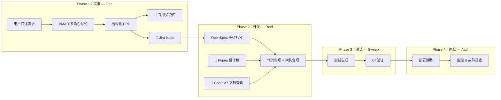
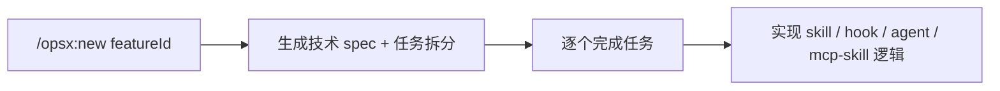

# DeepStorm — Spec 驱动的 AI 协同软件工程实践

DeepStorm 是一套基于 **Spec 驱动开发（SDD）** 和 **测试驱动开发（TDD）** 等成熟范式，结合当前 AI 工具链的工程实践方案和工具集。

**核心理念**：利用 AI 提升各环节的执行效率，同时以结构化 Spec 将需求、规范、验证、实现串联起来，使 AI 和人在一致的上下文中协作。

---

## 套件组成

| 套件 | 名称 | 形式 | 主要职责 |
| --- | --- | --- | --- |
| **Tide** | 潮汐 | 套件（skills） | 需求结构化、PRD 管理、Jira 同步 |
| **Reef** | 礁群 | 套件（skills + agents + hooks） | 规范生成、代码实现、架构约束检查 |
| **Sweep** | 扫掠 | 套件（skills） | 测试生成、覆盖率分析、CI 结果解读 |
| **Atoll** | 环礁 | 套件（skills） | 部署辅助、监控查询、故障排查 |
| **CLI** | — | npm 包（`@deepstorm/cli`） | 一键安装向导、配置管理、模板管理、诊断 |

> **CLI 安装方式：** `npx @deepstorm/cli setup`。安装向导自动选取匹配的 skills/agents/hooks 复制到 `.claude/skills/`，无需网络下载。

---

## 全链路工作流

DeepStorm 四个套件覆盖产品→开发→测试→运维全链路，每个阶段使用对应的 tools（skills / agents / hooks）在独立的 Claude Code 会话中完成：



| 阶段 | 套件 | 核心能力 | 外部工具 / 依赖 |
|------|------|---------|----------------|
| Phase 1 | Tide | BMAD 需求讨论、PRD 生成、Jira 同步 | **BMAD Method**（必装）、grill-me（可选）、飞书知识库、Jira |
| Phase 2 | Reef | OpenSpec 任务拆分、代码实现、架构约束 | Figma、Context7、GitHub |
| Phase 3 | Sweep | 测试生成、覆盖率分析、CI 结果解读 | CI 系统 |
| Phase 4 | Atoll | 部署辅助、监控查询、故障排查 | 部署平台、监控系统 |

每个阶段在**独立的 Claude Code 会话**中完成，通过 PRD / Issue / GitHub 等标准化产出物衔接。

> **注意：** Phase 1（Tide）依赖 **BMAD Method** 框架（`npx bmad-method install`），另推荐安装 [grill-me](https://github.com/mattpocock/skills) 社区 skill 获得更好的需求追问体验。

---


## 项目结构

```
deepstorm/
├── packages/
│   ├── cli/           # @deepstorm/cli — npm 包 (TypeScript + esbuild)
│   │   ├── src/             # TypeScript 源码
│   │   │   ├── commands/    # CLI 命令（setup/config/template/doctor/uninstall/release）
│   │   │   ├── engine/      # 安装引擎（installer/registry）
│   │   │   ├── merger/      # 文件合并（settings/env/mcp/hooks）
│   │   │   ├── template/    # 模板渲染（Handlebars）
│   │   │   ├── wizard/      # 向导流程
│   │   │   ├── types/       # 类型定义
│   │   │   ├── utils/       # 工具函数
│   │   │   └── build-registry.ts  # 构建时 registry 聚合
│   │   ├── scripts/         # 构建/发布脚本
│   │   ├── mcp/             # MCP 服务器配置（按 domain 分组）
│   │   ├── mcp-skills/      # MCP 使用指南 skill
│   │   ├── config-schema.json  # deepstorm 配置 JSON Schema
│   │   └── dist/            # 构建产物 (gitignored)
│   ├── tide/          # 产品侧套件（纯 skill，无编译）
│   │   ├── skills/          # 技能定义
│   │   └── wizard.json      # 向导配置
│   ├── reef/          # 开发侧套件
│   │   ├── skills/          # 代码生成、审计、风格等技能
│   │   ├── agents/          # 专项 AI Agent（代码审计等）
│   │   ├── hooks/           # Claude Code 生命周期 hook
│   │   └── wizard.json      # 向导配置
│   ├── sweep/         # 测试侧套件
│   │   ├── skills/          # 技能定义
│   │   └── wizard.json      # 向导配置
│   └── atoll/         # 运维侧套件
│       ├── skills/          # 运维技能
│       └── wizard.json      # 向导配置
├── docs/
│   └── deepstorm.html                     # 设计哲学
├── .claude/
│   ├── skills/        # BMAD 及 DeepStorm 自定义 skills
│   └── settings.local.json
└── package.json
```

> **架构关键点：** skills/agents/hooks 运行时数据分布在各 package（tide/reef/sweep/atoll）中，MCP 服务器配置集中存放在 `packages/cli/mcp/`（按 domain 分组），MCP 使用指南 skill 在 `packages/cli/mcp-skills/`。`pnpm build` 时由 `build-registry.ts` 聚合复制到 `dist/`，随 npm 包一同发布。

---

## 环境要求

| 工具 | 版本要求 | 说明 |
|------|---------|------|
| **Node.js** | ≥ 20.12 | 运行 BMAD 及 DeepStorm 套件 |
| **pnpm** | ≥ 9 | DeepStorm 项目依赖管理 |
| **Python** | ≥ 3.10 | BMAD 依赖 |
| **uv** | 最新 | Python 包管理器，`curl -LsSf https://astral.sh/uv/install.sh \| sh` |
| **BMAD Method** | 最新 | AI 敏捷开发框架，Tide 的前置依赖，`npx bmad-method install` |

## 快速开始

```bash
# 1. 安装项目依赖
pnpm install

# 2. 安装 BMAD Method（Tide 的前置依赖）
npx bmad-method install

# 3. 查看各子项目的 README 获取详细使用说明
cat packages/tide/README.md
cat packages/reef/README.md
cat packages/sweep/README.md
cat packages/atoll/README.md
```

### 套件安装

```bash
npx @deepstorm/cli setup
```

安装向导会引导选择工具、配置凭据，自动将 skills/agents/hooks 复制到 `.claude/skills/`。

### CLI 命令一览

| 命令 | 用途 | 说明 |
|------|------|------|
| `npx @deepstorm/cli setup` | 安装向导 | 交互式配置 + 复制 skills/agents/hooks |
| `npx @deepstorm/cli setup --reconfigure` | 重新配置 | 清空旧配置后重新运行向导 |
| `npx @deepstorm/cli setup --non-interactive` | 静默安装 | 通过 `--tools`/`--set` 参数传递配置 |
| `npx @deepstorm/cli config view` | 查看配置 | 输出当前 `deepstorm.*` 配置 |
| `npx @deepstorm/cli config set <key>=<value>` | 修改配置 | 修改单项配置（支持嵌套路径） |
| `npx @deepstorm/cli config reset` | 重置配置 | 清除所有 DeepStorm 配置 |
| `npx @deepstorm/cli config refresh` | 刷新模板 | 基于当前配置重新渲染所有 `.tmpl` 模板 |
| `npx @deepstorm/cli template list` | 模板列表 | 查看所有可用 skill 模板 |
| `npx @deepstorm/cli template init` | 导出模板 | 导出 skill 默认内容供用户修改 |
| `npx @deepstorm/cli template apply` | 应用模板 | 将用户修改的模板应用到 `.claude/skills/` |
| `npx @deepstorm/cli update` | 全量更新 | 检查 CLI 版本 + 同步已安装 skill 官方最新模板 |
| `npx @deepstorm/cli plugin build` | 构建插件 | 交互式构建 DeepStorm Claude Code 插件 |
| `npx @deepstorm/cli doctor` | 诊断 | 检查 CLI 配置、MCP 完整性等 |
| `npx @deepstorm/cli uninstall` | 卸载 | 清除所有 DeepStorm 生成的内容 |

### 开发者命令（项目根目录）

```bash
pnpm build              # 构建 CLI（esbuild 编译 → build-registry.ts 聚合 → dist/）
pnpm cli <command>      # 运行 CLI 命令（需先 pnpm build，如 pnpm cli doctor）
pnpm build:plugin       # 构建 CLI + 启动 DeepStorm 插件交互式向导（一步完成）
pnpm test               # 运行 CLI 单元测试
```

### 发版

DeepStorm 使用 AI 驱动的发版流程，在 Claude Code 中运行 `/deepstorm-release`：

1. 自动分析上次发布以来的 git 提交历史
2. AI 建议版本号（major / minor / patch），用户确认后继续
3. 自动生成并追加 CHANGELOG
4. 构建代码
5. 创建 release commit + git tag
6. 用户确认后执行 npm publish + git push

## 构建 DeepStorm Claude Code 插件

DeepStorm 支持将整个工具集打包为 **Claude Code Plugin**，方便在团队或组织内部分发和安装。

### 使用场景

- **团队分发**：将一个配置好的深流套件（含选定的工具 + MCP 服务）构建为插件，分享给团队成员一键安装
- **离线环境**：在联网环境构建后，可将产物带到离线 Claude Code 环境中使用
- **定制分发**：通过交互式向导，选择不同的工具套件组合和 MCP 服务，构建定制化的 DeepStorm 插件

### 构建流程

```bash
# 方式一：通过项目根命令（自动先构建 CLI，再启动向导）
pnpm build:plugin

# 方式二：直接调用已发布的 CLI
npx @deepstorm/cli plugin build
```

构建命令会以**交互式向导**引导你完成以下步骤：

1. **输入市场名** — 插件的发布者标识（如 `example-org`），格式建议 kebab-case
2. **选择工具套件** — 勾选需要包含的套件 (tide / reef / sweep / atoll)
3. **选择 MCP 服务** — 勾选插件需要绑定的 MCP 服务（如 Jira、GitHub 等）
4. **回答配置问题** — 根据所选工具套件回答个性化配置问题
5. **模板变量确认** — 确认自动生成的模板变量值

### 构建产物

构建完成后，输出目录位于 `.deepstorm/`，包含：

```
.deepstorm/
├── .claude-plugin/
│   ├── plugin.json          # 插件元数据（名称、版本、描述）
│   └── marketplace.json     # 市场注册信息
├── settings.json            # 插件设置（启用哪些 MCP 服务）
├── .mcp.json                # MCP 服务器配置（如有选中）
├── .env.example             # MCP 环境变量模板（如有选中）
├── README.md
├── CHANGELOG.md
├── skills/                  # 渲染后的 skill 文件
├── agents/                  # 渲染后的 agent 文件
└── hooks/                   # 渲染后的 hook 文件
```

### 安装插件

在 Claude Code 中使用插件安装命令：

```bash
/plugin install deepstorm@<marketplaceName>
```

例如，市场名为 `example-org`：

```bash
/plugin install deepstorm@example-org
```

安装后重启 Claude Code 会话，DeepStorm 工具套件即可生效。

### 本地测试

在插件目录下启动 Claude Code 进行本地测试：

```bash
claude --plugin-dir .deepstorm
```

---

## MCP 服务器配置

部分套件需要外部 MCP 服务器才能完整工作。所有 MCP 配置在项目根目录统一管理。

### 快速配置

```bash
# 1. 运行 CLI 安装向导（包含 MCP 服务选择）
npx @deepstorm/cli setup

# 2. 向导完成后，编辑 .env 填入实际 Token
#    或从模板创建后填写：
cp .env.example .env

# 3. 修改 .env 后重启 Claude Code 会话即可生效
```

安装向导中，MCP 服务按功能域（domain）分组展示：

| 域 | 服务 | 说明 |
|----|------|------|
| **项目管理**（project-management） | Jira | 任务跟踪与敏捷管理 |
| **代码托管**（code-hosting） | GitHub | 源码托管与协作 |
| **设计工具**（design-tools） | Figma | 原型设计与协作 |
| **知识管理**（knowledge-base） | 飞书知识库 | 文档协作与知识库 |

### 环境变量一览

所有凭据通过 `.env` 文件配置，CLI 安装向导会自动创建变量占位。环境变量名统一使用 `DEEPSTORM_` 前缀：

| 变量 | 对应 MCP 服务 | 用于哪些套件 | 获取方式 |
|------|-------------|-------------|---------|
| `DEEPSTORM_JIRA_TOKEN` | jira | tide, reef | [Atlassian API Tokens](https://id.atlassian.com/manage/security/api-tokens) → Create API token |
| `DEEPSTORM_GITHUB_TOKEN` | github | reef | [GitHub Tokens (classic)](https://github.com/settings/tokens) → 勾选 `repo`、`issues`、`pull_requests` |
| `DEEPSTORM_FIGMA_TOKEN` | figma | reef | [Figma Settings](https://www.figma.com/settings) → Personal access tokens |
| `DEEPSTORM_FEISHU_TOKEN` | feishu-wiki | tide, reef | 飞书开放平台 → 开发者后台 → 应用凭证 → 获取 Token |

### 各 MCP 服务器说明

| 服务器 | 域 | 用途 | 启动方式 | 备注 |
|--------|-----|------|---------|------|
| **jira** | project-management | tide — 发布 PRD 到 Jira Issue；reef — 获取 issue 详情、执行 JQL | `npx -y dotenv-cli -e .env -- npx -y jira-mcp --stdio` | |
| **github** | code-hosting | reef — 读取仓库、创建 PR、管理 Issue | `npx -y dotenv-cli -e .env -- docker run -i --rm -e GITHUB_PERSONAL_ACCESS_TOKEN ghcr.io/github/github-mcp-server` | 需要本地 Docker 环境 |
| **figma** | design-tools | reef — 获取设计稿数据驱动前端实现 | `npx -y dotenv-cli -e .env -- npx -y figma-developer-mcp --stdio` | |
| **feishu-wiki** | knowledge-base | tide — 发布/读取 PRD；reef — 读取 Jira 关联的 PRD 文档 | `npx -y dotenv-cli -e .env -- npx -y feishu-wiki@latest` | |

所有 MCP 服务使用统一的启动模式：`npx -y dotenv-cli -e .env -- npx -y <package>`，通过 `dotenv-cli` 自动加载 `.env` 中的 `DEEPSTORM_*` 变量并映射为对应 MCP 包所需的环境变量。

> **注意：** `.env` 已在 `.gitignore` 中，不会提交到仓库。安装向导会自动将选中的 MCP 配置合并到项目根目录的 `.mcp.json` 中，以 `deepstorm-{name}` 命名避免冲突。

---

| 约定 | 说明 |
|------|------|
| **套件组织** | 各套件通过 `packages/*/skills/`、`agents/`、`hooks/` 组织能力；MCP 服务器配置统一在 `packages/cli/mcp/` 管理；CLI 构建时聚合 |
| **纯 skill 套件** | tide 所有逻辑写在 SKILL.md 中，无需编译 |
| **API Keys** | 通过 `.env` 文件配置（`DEEPSTORM_*` 前缀），不会提交到 Git |
| **featureId 格式** | `MODULE-FEATURE-SUBFEATURE`（全大写 + 连字符，可含数字） |
| **sessionId 格式** | `tide-YYYYMMDD-NNN` |
| **Feature Toggle** | 各套件的能力可通过 `.claude/settings.local.json` / `.claude/settings.json` 控制，嵌套路径 `deepstorm.<module>.<feature>.enabled`（如 `deepstorm.tide.feishuUpload.enabled`），`settings.local.json` 优先，默认开启 |

### Feature Toggle 示例

以关闭 Tide 的飞书知识库上传为例，在项目 `.claude/settings.local.json` 中：

```json
{
  "deepstorm": {
    "tide": {
      "feishuUpload": {
        "enabled": false
      }
    }
  }
}
```

> 未配置时默认开启（`true`）。`settings.local.json` 优先级高于 `settings.json`。

## IDE 配置

编辑器和 CLI 工具配置在 `.editorconfig` 中：

- 缩进：2 空格（所有文件）
- 编码：UTF-8
- 换行：LF
- 行宽：120
- 文件末尾：保留换行
- 尾部空白：自动修剪（Markdown 除外）

---

## 开发工作流

DeepStorm 自身套件开发使用 **OpenSpec** 轻量流程：



每个 OpenSpec change 在**独立的 Claude Code 会话**中完成。

详细开发规范（含环境搭建、Code-Style 多维架构、模板引擎）请参阅 `docs/deepstorm-development.md`。

---

## 许可

MIT
# deepstorm
