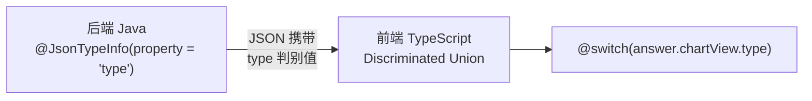

# Brainstorming Session — Jackson 多态序列化编码规范

- **日期：** 2026-07-09
- **主题：** 将 Jackson `@JsonTypeInfo` 多态序列化 + TypeScript discriminated union 模式沉淀为 reef-style-backend 编码规范
- **参与角色：** User (Dev) / Claude (AI)

## 讨论内容

### 背景

在 ChatBI 项目中，后端使用枚举 `ChartType` 标记图表类型（`METRIC_CARD`、`LINE_CHART`、`BAR_CHART`、`PIE_CHART`），前端也维护一个同名 enum。新增一种图表类型时，需要在后端枚举、前端枚举、后端 switch、模板 switch 共 4 处同步修改。

参考低代码项目（`DatasetDto` → `DatabaseDatasetDto | HttpDatasetDto`）的 Jackson 多态模式，完成了重构。

### 目标模式



### 方案

#### 核心变更

| 组件 | 旧模式 | 新模式 |
|------|--------|--------|
| 后端序列化 | `@JsonProperty("chartType")` + enum | `@JsonTypeInfo(property = "type")` + 抽象基类 |
| 后端字段 | `MetricAnswer.chartType: ChartType` | `MetricAnswer.chartView: ChartView` |
| 后端枚举 | `ChartType.java` | 删除 |
| 构建逻辑 | `determineChartType()` 返回 enum | `buildChartView()` 返回 `ChartView` 子类 |
| 前端类型 | `ChartType` enum（`METRIC_CARD` 等） | `ChartView` 联合类型（`MetricCardView \| LineChartView ...`） |
| 模板分发 | `@switch (answer.chartType)` | `@switch (answer.chartView.type)` |

#### 后端实现架构

```java
// 基类
@JsonTypeInfo(use = JsonTypeInfo.Id.SIMPLE_NAME, property = "type")
@JsonSubTypes({
    @JsonSubTypes.Type(value = MetricCardView.class, name = "MetricCardView"),
    @JsonSubTypes.Type(value = LineChartView.class, name = "LineChartView"),
    @JsonSubTypes.Type(value = BarChartView.class, name = "BarChartView"),
    @JsonSubTypes.Type(value = PieChartView.class, name = "PieChartView"),
})
public abstract class ChartView {}

// 子类（示例）
public class MetricCardView extends ChartView {
    private final String title;
    private final Object value;
    private final String unit;
    // constructor + getters
}

public class LineChartView extends ChartView {
    private final String title;
    @JsonProperty("xAxisName") private final String categoryAxisLabel;
    @JsonProperty("yAxisName") private final String valueAxisLabel;
    private final String seriesName;
    private final List<ChartDataPoint> dataPoints;
    // constructor + getters
}
```

#### 前端实现架构

```typescript
interface BaseChartView { type: string; }

export interface MetricCardView extends BaseChartView {
  type: 'MetricCardView';
  title: string; value: unknown; unit: string | null;
}

export type ChartView = MetricCardView | LineChartView | BarChartView | PieChartView;
```

### 关键决策

| # | 事项 | 结论 | 理由 |
|---|------|------|------|
| 1 | `property` 值 | `"type"`（非 `"chartType"`） | 简短通用，与低代码项目一致 |
| 2 | `@JsonTypeInfo.Id` | `SIMPLE_NAME` | 类名自描述，无需额外常量 |
| 3 | `@JsonSubTypes.Type.name` | 与 TS literal type 值一致 | 前后端必须严格对应 |
| 4 | 字段名 Checkstyle 冲突 | `@JsonProperty("xAxisName") private String categoryAxisLabel` | getter 合规（`getCategoryAxisLabel()`），JSON 仍是 `xAxisName` |
| 5 | 共享 DTO | `ChartDataPoint` 独立 record | 多个子类复用 |
| 6 | MetricAnswer 保持 record | 不能继承，直接替换 `chartType` 为 `chartView` | record 限制，不改造为类 |
| 7 | 后端 chartView 可为 null | 错误响应时 chartView = null | 保持一致，前端 `@if` 保护 |
| 8 | 前端旧类型保留 | `ChartData`、`gridResults`、`singleResults` 保留不删 | chartView 是视图抽象，不替代数据层 |

### 影响的文件

#### chatbi 项目（本次改造实例）

**新增（6 Java 文件）：**
- `chat/dto/ChartView.java` — 抽象基类
- `chat/dto/MetricCardView.java` — 指标卡视图
- `chat/dto/LineChartView.java` — 折线图视图
- `chat/dto/BarChartView.java` — 柱状图视图
- `chat/dto/PieChartView.java` — 饼图视图
- `chat/dto/ChartDataPoint.java` — 共享数据点 record

**修改（4 Java 文件）：**
- `chat/dto/MetricAnswer.java` — `chartType` → `chartView`
- `chat/service/MetricAnswerBuilder.java` — `determineChartType()` → `buildChartView()`
- 对应测试文件（3 个）

**前端（6 TypeScript/HTML 文件）：**
- `chat.service.ts` — ChartView 联合类型 + 删除 ChartType enum
- `chat.component.ts` — chartType → chartView.type 判断
- `chat.component.html` — @switch 更新
- 3 个 spec 文件更新 mock

#### reef-style-backend（本次规范沉淀）

**新增：**
- `fragments/java/api-spec/jackson-polymorphism.md` — 编码规范文档

### 风险与注意

1. 删除 `ChartType` enum 前要确认没有其他引用（本项目已确认安全）
2. `@JsonInclude(Include.NON_NULL)` 按需加入，非强制
3. 测试类 `ChatBiServiceDetermineChartTypeTest` 需同步重命名为 `ChatBiServiceBuildChartViewTest`
4. Checkstyle `ParameterNameCheck` 对 `xAxisName`/`yAxisName` 会报错，必须用 `@JsonProperty` 解耦
