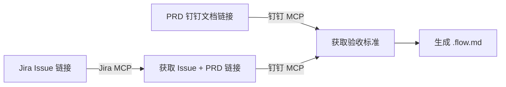

## Context

Sweep 是 DeepStorm 测试侧套件，定位为 E2E 测试流程的工程化管理工具。当前仅有骨架结构，无实际 skill 能力。

在 AI 编程时代，测试工程师的核心价值从"写测试代码"迁移到"定义测试策略和质量门禁"。Sweep 采用 .flow.md 测试意图文档驱动模式——用自然语言描述测试流程，通过 Playwright MCP 直接执行，不再需要维护传统的 Playwright 测试代码文件。

## Goals / Non-Goals

**Goals:**
- 定义 E2E 测试项目的目录结构和文件规范
- 定义 .flow.md 测试意图文档的格式规范
- 设计 setup / flow-create / flow-run 三个 skill 的实现路径
- 设计多环境配置管理方案
- 设计钉钉 + Jira MCP 的 PRD 读取流程
- 设计功能模块拓扑文件的格式和管理方式

**Non-Goals:**
- 不涉及 CI 集成（第二期考虑）
- 不涉及 agents/hooks（MVP 阶段纯 skills）
- 不涉及测试代码生成（生成可执行代码的方式已舍弃，改用 .flow.md + MCP 模式）
- 不涉及与 Reef 的产物（test-cases.md）的耦合——Sweep 直接从 PRD 读取，不依赖开发侧产物

## Decisions

### 1. 项目结构

**决策：** E2E 测试项目采用以下目录结构：

```
{e2e-project}/
├── flows/                       # 测试意图文档目录
│   ├── topology.yaml            # 功能模块拓扑定义（AI + 人共同维护）
│   ├── user-system/             # 按模块层级组织
│   │   ├── register.flow.md
│   │   ├── login.flow.md
│   │   └── password.flow.md
│   ├── payment/
│   │   ├── checkout.flow.md
│   │   └── refund.flow.md
│   └── reports/                 # 执行报告持久化目录
│       ├── login-20260613-1430.report.md
│       └── payment-20260613-1500.report.md
├── playwright.config.ts         # Playwright 配置（含多环境 baseURL 模板）
├── .env                         # 环境配置（gitignored）
├── .env.example                 # 环境配置模板（提交用）
├── package.json                 # 依赖声明
├── tsconfig.json                # TypeScript 配置
└── src/                         # Page Object Model（可选，按需使用）
    ├── pages/
    └── utils/
```

**理由：**
- flows/ 目录集中存放所有 .flow.md，按模块层级组织便于导航
- reports/ 与 flows/ 放在一起，贴近执行上下文
- .env 遵循 Node.js 生态标准；playwright.config.ts 原生支持 BASE_URL 环境变量
- src/ 为可选——当测试流程变得复杂时，可通过 Page Object Model 复用操作逻辑

---

### 2. 功能模块拓扑文件（topology.yaml）

**决策：** 在 flows/ 目录下创建一个显式的 `topology.yaml` 文件，描述功能模块的树状层次结构。

```yaml
# flows/topology.yaml
name: E2E 测试拓扑
version: 1

modules:
  - name: user-system
    description: 用户系统
    children:
      - name: register
        description: 用户注册
      - name: login
        description: 用户登录

  - name: payment
    description: 支付系统
    children:
      - name: checkout
        description: 结算流程
```

**用途：**
- **flow-create 时**：读取拓扑文件，分析 PRD/Jira 内容后推荐放置位置，用户确认或选择其他目录
- **flow-run 时**：展示层级菜单，用户逐级进入选择要执行的模块范围
- **维护方式**：AI + 人共同维护。初始由 setup 创建基础结构，后续可通过对话或手动编辑更新

**理由：**
- 显式拓扑文件比仅靠目录结构更灵活——可以描述目录名之外的业务含义
- YAML 格式 AI 易解析，人也易编辑
- 避免"新增 flow 该放哪"的决策困难——AI 推荐 + 用户确认

**备选方案：** 仅靠目录结构隐式推断——否决。缺乏业务语义描述，AI 推荐的准确度不够。

---

### 3. 文件命名规则

**决策：** .flow.md 文件以其对应的功能模块或 Jira Issue 任务名称为文件名，kebab-case 格式。

```yaml
# 按功能模块命名（通用场景）
user-system/
  register.flow.md       # 注册功能
  login.flow.md          # 登录功能

# 按 Jira 任务命名（绑定迭代）
sprint-24/
  LC-1234-user-auth.flow.md
  LC-1245-password-reset.flow.md
```

**理由：**
- 功能模块命名：长期维护，与 topology.yaml 的模块结构对应
- 任务命名：与 Jira Issue 直接对应，适合按迭代组织
- flow-create 根据输入源推荐命名方式

**备选方案：** 将 .env 内容写入 .claude/settings.json——否决。settings.json 是 Claude Code 自身的配置，不应混入测试项目配置。

---

### 2. .flow.md 格式规范

**决策：** .flow.md 包含场景清单（给人快速浏览）和执行流程（给 AI 逐步骤执行），合二为一：

```markdown
# E2E 测试流程：{功能名称}

## 场景清单

| ID | 场景 | 类型 | 优先级 |
|----|------|------|--------|
| L01 | 正常登录成功 | 正常流程 | P0 |
| L02 | 错误密码登录 | 异常场景 | P1 |

---

## Flow: L01 - {场景标题}

### 前置条件
{必要的前置状态或数据}

### 执行步骤
1. {操作步骤描述}
   ✅ 验证点：{预期结果}

### 环境要求
- 目标环境：{test / staging / prod}
- 所需账号：{账号类型或角色}
```

**理由：**
- 顶部场景清单让 Reviewer 快速扫一遍就知道覆盖了哪些场景，不用通读全文件
- 执行步骤内的 ✅ 验证点就是断言，AI 读到后通过 Playwright MCP 验证
- 自然语言描述，人也能照着操作

---

### 3. 多环境配置

**决策：** 通过 .env 文件管理环境信息，运行时用 `--env` 切换：

```
# .env（setup 时写入）
BASE_URL_TEST=https://test.example.com
BASE_URL_STAGING=https://staging.example.com
BASE_URL_PROD=https://prod.example.com
DEFAULT_ENV=test
```

| 能力 | 说明 |
|------|------|
| setup 时询问 | 分别输入三个环境的 URL |
| setup 时写入 | 写入 .env（gitignored）+ .env.example（提交） |
| 运行时切换 | `/sweep:run flows/login.flow.md --env staging` |
| 读取方式 | playwright.config.ts 通过 process.env.BASE_URL 读取 |

**理由：**
- Playwright 原生支持 baseURL 配置，不需要额外抽象
- .env 是 Node.js 生态标准配置方式
- `--env` 参数简单直观，用户不需要修改文件就能切换环境

---

### 4. Setup 作为硬性前置条件

**决策：** flow-create 和 flow-run 在执行前检查项目根目录是否存在 `.sweep-init` 标记文件（或校验 .env 和 playwright.config.ts 是否存在）。未初始化时报错并提示：

> 当前目录尚未初始化为 Sweep 测试项目。请先运行 `/sweep:init` 初始化。

**理由：**
- 防止在无配置的目录中运行命令
- 初始化仅需一次，标记文件确认 setup 已完成

---

### 5. 钉钉 MCP 读取 PRD

**决策：** flow-create 通过钉钉 MCP 服务读取 PRD 内容，获取验收标准和业务规则。skill 内部通过 MCP 工具调用（如 `mcp__dingtalk__readDocument`）获取 PRD 内容，然后在结构化对话中引导测试工程师补充业务上下文。

**理由：**
- Tide 写入钉钉，Sweep 读取——职责分明
- 测试工程师不需要手动粘贴 PRD 内容，减少操作步骤
- 获取到 PRD 后即可提取验收标准列表，作为 flow 生成的输入

---

### 6. Flow-run 执行层级

**决策：** flow-create 支持两种输入方式：



- 用户提供 Jira Issue 链接 → Jira MCP 读取 Issue 内容 + 提取关联 PRD 链接 → 钉钉 MCP 读取 PRD
- 用户直接提供 PRD 链接 → 钉钉 MCP 直接读取
- 两种后备：用户无链接时直接描述功能场景

---

### 7. Flow-run 执行层级

**决策：** `/sweep:run` 支持交互式选择 + 直接指定两种模式：

**交互模式**（不带参数）：
1. 读取 topology.yaml，展示当前层级模块
2. 通过 Node.js inquirer `@inquirer/checkbox` 渲染可勾选列表（第一项为"全部执行"）
3. 默认展示第一层，用户空格勾选 + 回车确认
4. 如果选择某个模块且该模块有子模块，继续进入下一层展示子模块
5. 如果选择"全部执行"或选择了无子模块的叶子模块，开始执行

交互脚本放在 `scripts/flow-selector.mjs`，由 flow-run skill 调用。

**直接指定模式**（带参数）：
```bash
/sweep:run --all                       # 全量执行
/sweep:run --path user-system/login    # 按模块路径
/sweep:run flows/user-system/login.flow.md           # 单文件
/sweep:run flows/user-system/login.flow.md --flow L02  # 单 flow
```

执行报告同时输出到终端（实时）和 `flows/reports/{name}-{timestamp}.report.md`（持久化）。

---

### 7. Flow 变更管理策略

**决策：** 小改动（步骤文案调整、补充验证点）直接编辑 .flow.md 文件提交；大改动（新增功能测试流程、流程重构）走 OpenSpec change 管理，配套写 spec、design、tasks，确保团队 Review。

---

## Risks / Trade-offs

| 风险 | 缓解措施 |
|------|---------|
| .flow.md 自然语言描述存在歧义，AI 执行时理解偏差 | 每个验证点使用 ✅ 标记明确断言位置；执行时 AI 逐步骤确认后再进入下一步 |
| 钉钉 MCP 不可用或 PRD 中无测试相关信息 | flow-create 引导用户直接描述业务场景作为后备输入 |
| 测试项目独立于开发仓库，没有 git 共享基础设施 | 测试工程师自行管理测试仓库，Sweep 不绑定特定 CI 或代码托管平台 |
| AI 执行速度受 Playwright MCP 响应时间影响 | 终端实时输出执行进度，用户随时可中断 |
| .flow.md 没有代码那种编译期验证 | 执行即验证——flow-run 跑一遍就相当于编译检查 |

## Open Questions

- 测试账号等敏感信息除 .env 外，是否需要更安全的凭据管理方案？(MVP 阶段先放 .env，后续再看)
- Page Object Model 是否应该成为 Sweep 默认推荐模式，还是可选补充？（MVP 阶段先不做，看使用情况）
