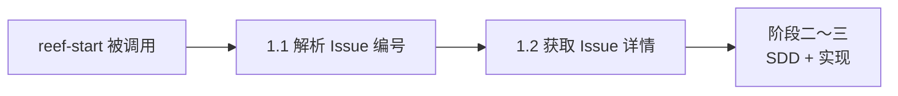
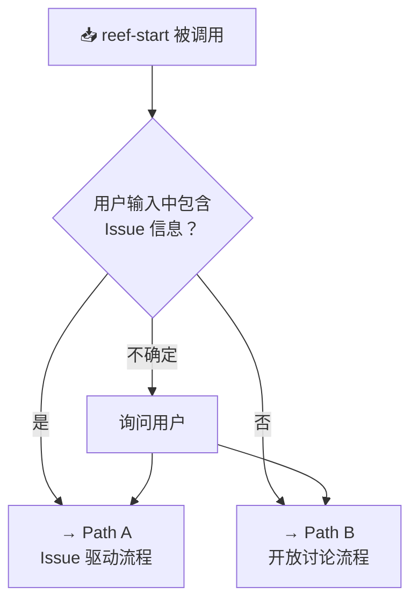

## Context

当前 reef-start skill(`packages/reef/skills/reef-start/SKILL.md.tmpl`) 从阶段一开始就假设用户有 Issue 信息，整个流程围绕 Issue 驱动设计。当无 Issue 时，skill 仍然试图获取 Issue 编号，体验不佳。

## Goals / Non-Goals

### Goals
- 在 reef-start 最开头增加入口路由决策（Entry Decision）
- Path B 支持"无 Issue 时的开放讨论流程"
- 两条路径在 superpowers 门禁处汇合，实现阶段复用现有 TDD 流程
- 不修改 Path A 的现有功能逻辑

### Non-Goals
- 不修改 reef-start 的阶段四 TDD 实现流程
- 不修改阶段五分支结束处理
- 不修改其他技能或套件
- 不修改 openspec 工具的自身行为

## Decisions

### Decision 1：入口路由放在 SKILL.md 最开头，独立于现有阶段结构

**方案：** 在 SKILL.md 头部新增一个"入口路由"段，位于横线 `---` 元信息和 `## 功能概述` 之间。

**理由：** 路由判断发生在任何阶段之前，独立于现有阶段嵌套结构，避免改动已有阶段编号。

### Decision 2：Path B 不创建 git 分支，分支延迟到实现前

**方案：** Path B 跳过"阶段二：创建分支"，分支操作延迟到 superpowers 门禁通过后、TDD 实现开始前。

**理由：** 开放讨论的需求范围在讨论前不确定，提前创建分支可能导致分支名不合理。分支名应与 OpenSpec change 名一致。

### Decision 3：Path B 的 OpenSpec change 名通过讨论摘要自动生成

**方案：** 需求讨论开始时用临时名称（如 `temp-discussion`）创建 OpenSpec change，讨论结束后根据讨论摘要重新命名。

**替代方案：** 讨论结束后再创建 OpenSpec change。**否决**，因为讨论中的 brainstorming 文件需要关联到 change。

**最终方案：** 讨论前根据用户第一句话提取 3-6 词英文摘要作为 change 名。如果讨论后发现名称不准确，通过 `openspec rename` 更正。

### Decision 4：两条路径共享同一套 SDD 流程（proposal→specs→design→tasks）

**方案：** Path B 的 SDD 流程复用 Path A 的现有流程（阶段三），入口不同但文档生成逻辑一致。

**理由：** 避免重复定义 SDD 流程规范。区别仅在于 Path B 的 proposal 输入来自 brainstorming 文件而非 Issue 信息。

## Risks / Trade-offs

| 风险 | 缓解措施 |
|------|---------|
| Path B 讨论时间过长，范围蔓延 | 通过 BMAD 框架控制讨论节奏，明确需求边界 |
| 用户输入模糊，路由判断错误 | 添加"不确定"分支，引导用户选择 |
| SKILL.md.tmpl 复杂度增加 | 使用 Mermaid 流程图可视化两条路径，保持结构清晰 |
