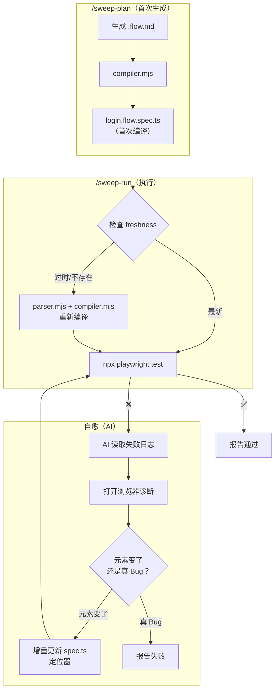

## Context

当前 `/sweep-run` 的执行链路是纯 AI 驱动的：AI 读取 `.flow.md` → 理解结构 → 逐步骤通过 Playwright MCP 操作浏览器。这个架构保证了灵活性和容错性（AI 能理解页面上下文），但执行速度严重受限于 LLM 推理延迟和 MCP 单步调用开销。

已有的加速手段（`browser_run_code_unsafe` 批量 + 多 Agent 并行）能带来 ~4-8x 加速，但本质上仍然是"AI 生成脚本 → 执行"模式，每次跑都要花 LLM 推理时间生成脚本。如果能做到"脚本预生成 → 原生执行"（`npx playwright test`），则大部分场景可以实现 10-20x 加速。

此前放弃预生成 `.spec.ts` 的原因是页面元素变更后 spec 会失效，维护成本高。本设计引入 AI 驱动的"自动修复"机制来解决这个问题。

## Goals / Non-Goals

**Goals:**
- 将 sweep-run 的默认执行路径从"AI 解析 + AI 驱动"变为"预编译脚本 + 原生 Playwright 执行"
- 平均执行速度提升至原来的 10x 以上（70% 场景走快速路径）
- 页面元素变更时 AI 自动修复 spec，无需人工维护
- 与现有参数（`--browser`、`--no-parallel`、`--all`、`--path`、`--flow`）保持兼容

**Non-Goals:**
- 不改变 `.flow.md` 的编写格式和体验 — 测试工程师仍然写 `.flow.md`
- 不替换 Playwright 为其他测试框架
- 不处理跨 Flow 的依赖编排（Flow 间假设无依赖）

## Decisions

### 决策 1：解析器实现方式 — 轻量 Node.js 脚本，非 AI

**选项 A：纯 Node.js 解析器（选中）**
- 用 `gray-matter` 提取 frontmatter
- 用正则解析 Flow 结构（`## Flow:` 标记、`### 前置条件`、`### 执行步骤` 等章节）
- 用正则提取验证点（`✅ 验证点：` 标记）
- 输出结构化 JSON

**选项 B：AI 辅助解析**
- 让 AI 读取 `.flow.md` 后结构化输出
- 优点是能处理格式差异，缺点是仍然有 LLM 延迟

**选 A 的理由：** `.flow.md` 有明确的 Markdown 结构约定（frontmatter + 场景表格 + Flow 章节），格式是规范化的。解析器一旦写好就是微秒级，且测试覆盖后不可能"理解错误"。AI 解析再怎么优化也是秒级，且偶有理解偏差。

### 决策 2：spec.ts 存储位置 — 与 .flow.md 同目录

**选项 A：同目录 + 后缀（选中）**
- `.flow.md` → `.flow.spec.ts`（同目录）
- 示例：`flows/user-system/login/login.flow.md` → `flows/user-system/login/login.flow.spec.ts`
- 便于一一对应，一目了然

**选项 B：集中目录**
- 所有 spec 放到 `flows/.specs/`
- 目录结构镜像 flows 结构

**选项 C：gitignore 模式**
- spec 不在 git 中跟踪，每次 run 前重新生成

**选 A 的理由：** 对应关系清晰；默认被 `playwright.config.ts` 的 `testMatch` 识别；git 中跟踪的话评审 diff 能看到 spec 的变化。但 `.gitignore` 中需要排除 `*.flow.spec.ts` 以允许 AI 自动修复时更新。

### 决策 3：spec.ts 生成策略 — plan 首次生成 + run 按需更新

**采用方案（plan 时首次生成 + run 时按需更新）：**

| 阶段 | 行为 | 产出 |
|------|------|------|
| `/sweep-plan` | 写完 .flow.md 后自动调用编译器 | 首次生成 `.flow.spec.ts` |
| `/sweep-run` | 检查 freshness，过时则重新编译 | 按需更新 `.flow.spec.ts` |
| 自愈引擎 | 元素变化时直接修改定位器 | 增量更新 `.flow.spec.ts` |

**为什么不在 run 时才首次编译：**
- plan 的产出物更完整：一次性交付"人工可读的测试设计 + 机器可执行的测试脚本"
- 首次 run 不必等编译，直接执行
- 职责清晰：plan = 初次生成，run = 更新/维护

### 决策 4：自愈机制触发条件 — 仅当 spec.ts 执行失败

自愈流程只在 **spec.ts 执行有失败** 时触发。这意味着：
- 全部通过 → 不调 AI，最快路径
- 有失败 → AI 介入诊断 → 修复 spec 或报告 Bug
- 不检查"做了新 flow 但没 spec"的情况（编译阶段覆盖）

### 决策 5：自愈机制的工作模式 — AI 驱动，非自动重试

AI 不是简单重试 spec，而是：
1. 读取 Playwright 失败日志（哪个定位器失败、什么错误）
2. 通过 Playwright MCP 打开浏览器，导航到目标页面
3. AI 观察实际页面，与 spec 中的定位器对比
4. 判断：
   - 元素变了（selector 失效）→ 更新 spec.ts 中的定位器 → 重新执行确认
   - 功能变了（元素不存在、行为不同）→ 报告为 Bug → 提示人工确认
5. 如果是定位器修复，写回 `.flow.spec.ts` 并标注 `# auto-repaired`
6. 如果依然失败 → 保留原始失败报告

## Architecture

### 两个入口

```
┌──────────────────────────────────────────┐
│ 入口 A：/sweep-plan                      │
│ 生成 .flow.md 后 → 调用编译器            │
│ → 产出 .flow.spec.ts（首次编译）          │
└──────────────────────────────────────────┘

┌──────────────────────────────────────────┐
│ 入口 B：/sweep-run                       │
│ 检查 .spec.ts freshness                  │
│ ┌─ 最新 → 直接执行 npx playwright test  │
│ └─ 过时/不存在 → 重新解析 + 编译后执行   │
│ 失败 → 自愈引擎 → 增量更新 spec.ts       │
└──────────────────────────────────────────┘
```

### sweep-run 执行流程

```
sweep-run 入口
    │
    ▼
┌──────────────────────────────────────────────────┐
│ 检查 .flow.spec.ts freshness                      │
│（比较 .flow.md 和 .flow.spec.ts 的修改时间）      │
├──────────────────────────────────────────────────┤
│ 最新 → SKIP 编译                                  │
│ 过时 → 解析器 + 编译器重新生成                    │
│ 不存在 → 解析器 + 编译器首次生成                  │
└──────────────────────┬───────────────────────────┘
                       │
                       ▼
┌──────────────────────────────────────────────────┐
│ npx playwright test .flow.spec.ts                 │
└──────────────────────┬───────────────────────────┘
                       │
                ┌──────┴──────┐
                ▼              ▼
           全部通过 ✅     有失败 ❌
                │              │
                ▼              ▼
           ✅ 完成         ┌──────────────────────────┐
                           │ AI 自愈引擎               │
                           │ 1. 读取失败日志 + 截图    │
                           │ 2. 打开浏览器诊断          │
                           │ 3. 元素变了？→ 更新 spec   │
                           │ 4. 真 Bug？→ 报告         │
                           └──────────────────────────┘
```

### 文件结构变化

```
flows/user-system/login/
├── login.flow.md              # 已有：测试意图文档
└── login.flow.spec.ts         # 新增：预编译 Playwright 测试脚本
```

playground/e2e 项目：
```
playground/e2e/
├── playwright.config.ts       # 需确认存在（sweep-init 应已生成）
├── package.json                # 新增 @playwright/test devDependency
└── flows/
    └── user-system/login/
        ├── login.flow.md
        └── login.flow.spec.ts
```

### 关键数据流



## Risks / Trade-offs

| 风险 | 缓解措施 |
|------|---------|
| 解析器过于严格，无法处理格式不规范的 `.flow.md` | 解析器提供宽松模式（fallback 到关键字段提取）；对无法解析的文件依然回退到 AI 执行 |
| 自愈机制中 AI 误判（把 Bug 当成元素变化，更新 spec 掩盖了真 Bug） | 强制 AI 在自愈后**重新执行** spec 至少一次确认通过；如果二次失败仍存在则拒绝自愈，保留失败 |
| 自愈更新 spec.ts 后丢失人工评审 | `.flow.spec.ts` 在 `.gitignore` 中排除，视为生成产物不评审；人工改 `.flow.md` 后重新编译即可 |
| Playwright 原生执行缺乏 AI 的上下文理解能力（如动态内容、验证码等） | 遇到 Playwright 无法处理的情况（如验证码），spec 应标记为 `// AI_REQUIRED`，跳过原生执行直接走 AI 驱动模式 |
| 性能提升预期与实际差距大 | 即使只有 50% 场景走快速路径（而非预期的 70%），整体也有 >5x 加速，仍显著优于现状 |

## Open Questions

- 解析器是否需要一个"干燥运行"模式，让用户预览解析结果是否准确？
- 当 AI 更新了 spec.ts 后，需要通知用户吗（比如"已自动修复定位器：selector 从 `.btn-submit` 变为 `button[type=submit]`"）？
- Playwright 配置中的 `testMatch` 是否需要调整为仅匹配 `*.flow.spec.ts` 以避免与项目中的其他 spec 冲突？
