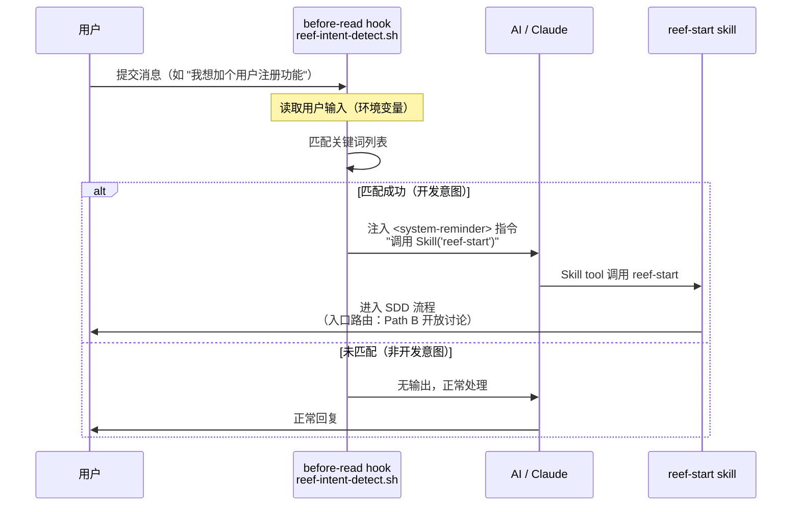

## Context

Reef 安装到用户项目后，通过 `.claude/hooks/hooks.json` 部署了多类自动化 hook（PreToolUse 拦截危险命令、PostToolUse 自动格式化、Stop 运行测试），但这些 hook 都作用于**工具执行**阶段（ToolUse / Stop）。在**用户消息入口**（用户输入一条消息但 AI 尚未处理）这个更前置的阶段，目前没有任何拦截机制。

当用户自然口述"我想加一个用户注册功能"时，这个意图没有被识别，AI 直接按常规对话处理。用户必须手动输入 `/reef-start` 才能触发 SDD 流程。

Claude Code 支持 `before-read` hook 类型，在每次用户消息到达时、AI 处理之前执行，可以输出指令注入到 AI 上下文中。这是实现意图自动检测的天然 hook 点。

现有的部署基础设施（`mergeHooks`、`copyDir`、`reconfigure`）已成熟，只需在 reef 的 `hooks.json` 中新增 `BeforeRead` 条目，并新增对应的检测脚本。

## Goals / Non-Goals

**Goals:**
- 用户自然输入开发需求时，自动唤起 reef-start skill
- 非开发意图的消息正常通过，零影响
- 检测机制轻量级（纯 bash + grep，毫秒级执行）
- 通过现有的 reef 安装/更新流程自动部署
- 匹配规则可通过配置文件扩展

**Non-Goals:**
- 不做多轮对话的意图累积（只在单条消息层面做判断）
- 不做 NLP / ML 模型调用
- 不修改现有 hook 行为或删除已有 hook
- 不支持在 `before-read` hook 中判断用户是否在已有开发流程中（这由 AI 侧处理更合适—`before-read` hook 无会话状态）

## Decisions

### Decision 1: Hook type 选择 `BeforeRead` vs `MsgReceive` vs Shell 包装

**选择：`BeforeRead`**

| 选项 | 可行性 | 原因 |
|------|--------|------|
| `BeforeRead`（标准 hooks.json） | ✅ 可用 | Claude Code 原生支持。在用户消息到达后、AI 处理前执行。hook stdout 注入到 AI 上下文。 |
| `MsgReceive`（平台扩展） | ❌ 不存在 | Claude Code 无此 hook 类型 |
| Shell 包装（alias/wrapper） | ❌ 不可行 | 无法包装 Claude Code 的 STDIN 管道 |

### Decision 2: 意图检测策略

**选择：基于关键词的 bash 脚本**

| 选项 | 权衡 |
|------|------|
| **Bash + grep 关键词匹配** ✅ | ✅ 毫秒级、零依赖、可扩展；❌ 匹配精度受限于关键词列表 |
| API 调用 LLM 分类 | ❌ 延迟高、有外部依赖、费用不可控、hook 不支持异步等待 |
| 正则表达式 | 部分采用（如 Issue 编号模式），但作为 grep 的补充而非替代 |

### Decision 3: Hook 触发机制

**选择：Hook stdout 注入指令**

`before-read` hook 的工作方式是：stdout 输出内容会被注入到 AI 上下文中（类似 `<system-reminder>`）。我们将输出一条明确的指令让 AI 调用 `reef-start` skill。

| 选项 | 权衡 |
|------|------|
| **stdout 注入指令** ✅ | ✅ 简单可靠、标准机制；AI 可按指令执行 |
| 非零退出码 | ❌ `before-read` hook 的非零退出码会终止请求而非注入指令 |
| 写标记文件 | ❌ 增加层级，可能有过期文件问题 |

**注入格式示例：**

```
<system-reminder>
The user's message suggests a development task.
Before responding, invoke the reef-start skill using the Skill tool.
Pass the user's original message as context.
</system-reminder>
```

### Decision 4: 关键词配置方式

**选择：关键词嵌入脚本本身 + 用户可覆盖**

| 选项 | 权衡 |
|------|------|
| **脚本内嵌 + 注释说明可扩展** ✅ | ✅ 简单、自包含、无额外文件依赖 |
| 外部 JSON/YAML 配置文件 | ❌ 增加复杂性；用户很少自定义关键词 |

策略：关键模式定义在脚本顶部作为数组变量，并注释说明高级用户可如何扩展。如果未来发现有大量自定义需求，再迁移到外部配置文件。

### Decision 5: 已处于开发流程中的防重复触发

**选择：通过 AI 侧上下文判断**

当 AI 已经处于 reef-start 流程中时，不应该再重新触发。`before-read` hook 没有会话状态感知能力，所以这个判断由 AI 自己完成——如果 AI 的上下文中已有 reef-start 的上下文，忽略 hook 的激发指令。

这通过在 hook 注入指令中添加条件约束来实现：

```
IMPORTANT: Only invoke reef-start if you are NOT already in a development flow
(reef-start, deepstorm-discuss, or any OpenSpec change is already active).
```

### Decision 6: 脚本部署方式

**选择：通过现有 `copyDir` 基础设施部署**

reef hook 脚本目前通过 CLI 的 `build-registry.ts` 中的 `copyAssetDirs` 从 `packages/reef/hooks/` 复制到 dist，安装时再由 `runSetup.ts` 的 `copyDir` 复制到目标项目的 `.claude/hooks/`。新脚本跟随此模式。

## 架构设计

### Hook 触发链路



### 文件结构

```
packages/reef/hooks/
├── hooks.json                      # 修改：新增 BeforeRead 条目
├── reef-intent-detect.sh           # 新建：意图检测脚本
├── reef-block-dangerous.sh         # 不变
├── reef-protect-files.sh           # 不变
├── reef-auto-format.sh.tmpl        # 不变
└── reef-run-tests.sh               # 不变
```

### hooks.json 变更

```jsonc
{
  "hooks": {
    "BeforeRead": [                    // 新增
      {
        "matcher": "*",                // 匹配所有用户消息
        "hooks": [
          {
            "type": "command",
            "command": "bash ${CLAUDE_PLUGIN_ROOT}/hooks/reef-intent-detect.sh"
          }
        ]
      }
    ],
    "PreToolUse": [                    // 已有，不变
      // ... 现有配置
    ],
    "PostToolUse": [                   // 已有，不变
      // ... 现有配置
    ],
    "Stop": [                          // 已有，不变
      // ... 现有配置
    ]
  }
}
```

### 检测脚本结构

```bash
#!/bin/bash
# reef-intent-detect.sh
# BeforeRead hook: 检测用户输入是否为开发需求，如果是则指示 AI 调用 reef-start

MESSAGE="${CLAUDE_INPUT:-}"  # 来自 Claude Code 环境变量

[ -z "$MESSAGE" ] && exit 0

# 中文开发意图关键词
ZH_PATTERNS=(
  "我想加" "我要加" "我需要" "加个功能"
  "实现一下" "帮我做个" "新增" "添加一个"
  "修复" "修一下" "bug" "有问题" "不正常"
  "重构" "重写" "优化" "改造" "提取"
  "改一下" "修改" "改成" "加一个" "写个"
)

# 英文开发意图关键词
EN_PATTERNS=(
  "add a" "implement" "build a" "create a"
  "new feature" "refactor" "rewrite" "fix"
  "bug" "broken" "not working" "optimize"
)

# 合并匹配
for pattern in "${ZH_PATTERNS[@]}" "${EN_PATTERNS[@]}"; do
  if echo "$MESSAGE" | grep -qiE "$pattern"; then
    cat <<'HOOKEOF'
<system-reminder>
The user's message indicates a development task (feature/bug/refactor).
IMPORTANT: Before responding, you MUST invoke the reef-start skill using the Skill tool.
Pass the user's original message as context to the skill.
Only skip if reef-start is already active or you are already in a development flow.
</system-reminder>
HOOKEOF
    exit 0
  fi
done

exit 0
```

## Risks / Trade-offs

| 风险 | 影响 | 缓解措施 |
|------|------|---------|
| 关键词误匹配（false positive） | 用户说"帮我查个文档"却触发了 reef-start | 匹配规则要求强意图信号（如出现多个关键词），非开发意图的关键词（查、看、读）不作为触发词 |
| 关键词漏匹配（false negative） | 用户说了开发需求但没触发 | 提供可扩展的关键词列表，用户可自行添加 |
| Hook 执行影响性能 | 每次消息多执行一个 bash 脚本 | 脚本纯 bash+grep，通常在 1-5ms 内完成，对用户体验无感知 |
| 与其他 hook 冲突 | `BeforeRead` 被其他插件覆盖 | `mergeHooks` 使用 deepMerge，不会覆盖已有 hook |
| 注入指令在长上下文中被忽略 | AI 忽略注入指令 | 指令使用 `IMPORTANT` / `MUST` 等强约束措辞 |
| 用户已进入 reef-start 流程后重复触发 | 重复加载 skill | 注入指令中包含"仅在未处于开发流程时执行"的条件约束，由 AI 自行判断 |
