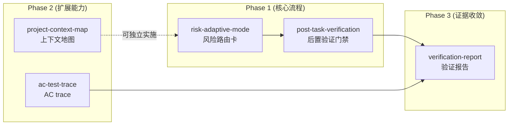

# Design — reef-start Lattice Adaptation

> capability: `reef-start-lattice-adaptation`

## Context

reef-start 是 DeepStorm 的入口开发 SKILL.md，覆盖 Path A（Issue-driven）和 Path B（open discussion）两条路径。当前所有代码变更走统一的 TDD 流程（阶段四），缺乏风险自适应档位。Lattice 的 PrismSpec 提供了 plan/tdd 自适应模式、后置验证门禁和结构化证据闭环等设计，可以在不改动 DeepStorm 基础设施的前提下借鉴。

本 change 的改动范围限定在 **reef-start SKILL.md 的流程描述层面**，不涉及：
- OpenSpec 核心工具（opsx）
- Pilot 自动执行引擎
- Sweep 测试套件
- 任何运行时基础设施

## Goals

1. 降低低风险变更的 TDD 开销 — 文档/配置变更不再强走 RED→GREEN→REFACTOR
2. 提高高风险变更的可信度 — 每个 task 完成前有硬性验证门禁
3. 提高 Agent 启动效率 — 每次 reef-start 启动时长尾的"项目概览"步骤，通过 context.md 缓存
4. 提供可追溯的验证证据 — 每个 change 产出 verify-report.json，归档后仍可查阅
5. 建立 AC→test 的显式链路 — 不再依赖口头约定

## Non-Goals

1. ❌ 不改造 OpenSpec 工具链（opsx）— 所有改动在 SKILL.md 流程层面
2. ❌ 不改造 Pilot daemon — Pilot 的执行不依赖本 change
3. ❌ 不做运行时 webhook 或 CI 集成 — 验证门禁在 Agent 对话中执行
4. ❌ 不做自动风险评分算法 — 风险判断由 Agent 根据规则表 + 人工确认

## Decisions

### D1: 风险路由作为 superpowers 门禁的一部分

**决策：** 风险路由嵌入现有 superpowers 门禁（阶段三→四之间），不新增独立阶段。

- **备选 A（选中）：** 修改现有 superpowers 检查段落，增加风险路由卡
- **备选 B：** 新增一个独立的"风险路由阶段" — ❌ 增加流程复杂度，superpowers 门禁正是做这个检查的位置
- **代价：** 现有的 superpowers 检查逻辑需要兼容 mode 选择

### D2: 验证门禁在 task 级别

**决策：** 验证门禁在 task 标记完成前执行，不在 change 级别聚合执行。

- **备选 A（选中）：** 每个 task 内 build → lint → test，通过才标完成
- **备选 B：** 所有 task 完成后集中验证 — ❌ 失败后再回头修 context switch 成本高
- **备选 C：** 只验证关键 task — ❌ 不一致，"有些 task 不需要验证"的判断标准模糊
- **代价：** lint 在每个 task 都跑可能重复劳动，但可通过缓存缓解

### D3: Context Map 独立文件

**决策：** `.deepstorm/context.md` 作为独立文件维护，CLAUDE.md 仅插一行引用。

- **备选 A（选中）：** 独立 `.deepstorm/context.md` 文件
- **备选 B：** 内容放入 CLAUDE.md — ❌ Git 噪音、合并冲突、职责混淆（行为规范 vs 项目事实）
- **备选 C：** 不维护 — ❌ 每次 reef-start 重新采集项目信息，重复 work
- **代价：** 多一个需要维护的文件，但更新频率低（实质性变化时才写）

### D4: Context 更新在阶段一结束

**决策：** context.md 的更新时机在 reef-start 阶段一（需求获取）结束时触发。

- **备选 A（选中）：** 阶段一结束时，对比已有内容后按需更新
- **备选 B：** 每次 reef-start 结束时更新 — ❌ 信息获取高峰在阶段一（读 Issue/PRD/代码），结束时已无新鲜信息
- **备选 C：** reef-start 启动时读取但永不更新 — ❌ 信息会过时
- **代价：** 需要 Agent 做 diff 判断"是否有实质性变化"

### D5: verify-report 的存储位置

**决策：** verify-report.json 放在对应 change 目录下，归档时随迁。

- **备选 A（选中）：** `openspec/changes/<change>/verify-report.json`
- **备选 B：** 全局 `.deepstorm/reports/` 目录 — ❌ 需要额外组织逻辑关联到 change
- **备选 C：** 不持久化 — ❌ 无法追溯，违背证据闭环的初衷
- **代价：** 无额外代价，随现有文件结构自然存储

### D6: AC-to-test trace 作为 code-audit 检查项

**决策：** AC trace 嵌入 code-audit 的检查清单，不新增独立阶段。

- **备选 A（选中）：** code-audit 清单加一行检查项
- **备选 B：** 新增独立 stage — ❌ 太重，只是一个检查项
- **备选 C：** 仅 Agent 自觉执行 — ❌ 无硬性约束，容易遗漏
- **代价：** code-audit 流程增加 1-2 分钟的 AC 回溯工作

## 5 Capabilities 之间的依赖关系

**说明：**
- risk-adaptive-mode 和 post-task-verification 无直接依赖，可并行实现
- verification-report 依赖 post-task-verification 和 ac-test-trace 的数据输入
- project-context-map 与其他能力正交，可独立实施

## Risks / Trade-offs

| 风险 | 影响 | 概率 | 缓解措施 |
|------|------|------|---------|
| Agent 错误判断风险级别（高估/低估） | 低风险走了 tdd 浪费 token，或高风险走了 plan 引入缺陷 | 中 | 默认 auto + 人工确认；plan→tdd 升级允许，tdd→plan 禁止 |
| 验证门禁在无测试框架的项目中失效 | 门禁形同虚设 | 高 | 兜底策略：Agent 询问用户可用命令，记录到 task 笔记 |
| context.md 无人维护过时 | 信息过时后 Agent 被误导 | 中 | 阶段一自动 diff 更新；CLI doctor 增加 context.md 时效性检查 |
| verify-report.json 的 AC trace 漏检 | 覆盖率不准确 | 低 | AC trace 只是 code-audit 的检查项之一，不替代人工 review |
| SKILL.md 的流程描述变长 | 增加阅读负担 | 中 | 风险路由卡等参考文档外置到 `references/`，SKILL.md 只保留流程指引 |

## Impact

- `packages/reef/skills/reef-start/SKILL.md` — 核心改动
    - 阶段三→四 superpowers 门禁增加风险路由卡 + mode 选择
    - 阶段四增加 plan mode 分支和后置验证步骤
    - 阶段五 code-audit 增加 AC trace 检查项
    - 阶段五之后增加 verify-report 生成
- `packages/reef/skills/reef-start/references/risk-routing-card.md` — 新增风险路由参考文档
- `packages/cli/src/commands/setup/` — CLI setup 增加 context.md 模板初始化
- 无 API/DB/外部系统影响
