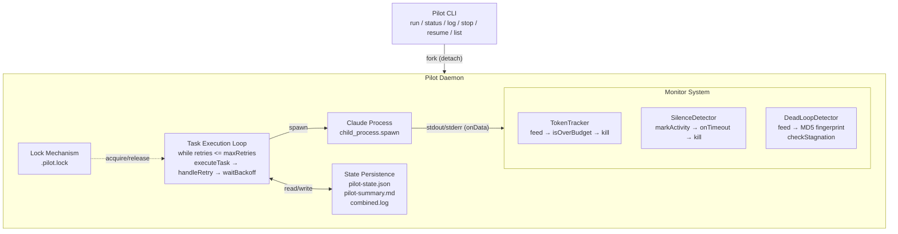
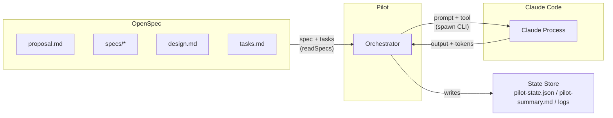

# @deepstorm/pilot

**OpenSpec 自动实现 Harness Agent** — 一个守护进程，读取 OpenSpec 产出的 proposal/specs/design/tasks，驱动 Claude Code 按序自动化实现。

Pilot 是 DeepStorm"开发侧"套件的核心组件，相当于一个永不停机的 AI 工程师：给它一个 OpenSpec 变更目录，它就能从头做到尾。

## 安装

```bash
pnpm add @deepstorm/pilot
```

## 快速开始

在包含 `tasks.md` 的项目目录中：

```bash
# 前台运行（实时看日志）
npx pilot run

# 后台运行（守护进程模式）
npx pilot run --detach

# 查看状态
npx pilot status

# 查看日志
npx pilot log

# 追踪最新日志
npx pilot log --follow

# 完成后停止
npx pilot stop
```

### 配合 DeepStorm CLI

安装 DeepStorm 后通过 `deepstorm` 命令访问：

```bash
deepstorm pilot run
deepstorm pilot status
deepstorm pilot log -f
deepstorm pilot stop
deepstorm pilot resume
deepstorm pilot list
```

## CLI 命令参考

| 命令 | 用途 | 关键选项 |
|------|------|---------|
| `run` | 启动 task 自动执行 | `-d, --detach` 后台运行；`-p, --project <dir>` 指定项目；`--tasks <file>` 指定自定义 tasks.md |
| `status` | 查看当前执行状态 | `-p, --project <dir>` |
| `log` | 查看执行日志 | `-t, --task <id>` 按 task 过滤；`-f, --follow` 实时追踪 |
| `stop` | 停止 daemon | `-f, --force` 强制 SIGKILL |
| `resume` | 恢复失败/跳过的 task | `-t, --task <id>` 恢复指定 task |
| `list` | 列出有 pilot 状态的项目 | `-d, --dir <path>` 扫描目录 |

### run

```bash
pilot run [options]
```

前置检查：
- `claude` CLI 是否可用（必须安装 Claude Code）
- 项目下是否存在 `tasks.md`
- 是否有其他 pilot daemon 已在运行（锁检查）

`--detach` 模式下，pilot 会 fork 一个子进程作为守护进程，父进程立即返回。通过 IPC 通信获取启动确认。

### log

```bash
pilot log [options]
```

默认显示所有 log 文件的内容。`--follow` 模式下：

1. 初始显示所有现有日志
2. 监听 `combined.log` 的文件变更事件
3. 每次变更时通过文件位置指针增量读取新追加的内容（**不是重新读取整个文件**）
4. 按行输出，每行加上 `[taskId]` 前缀

### resume

```bash
pilot resume [options]
```

恢复流程：
1. 停止状态的所有 task 的 `status` 重置为 `pending`，`retries` 清零
2. `isResumed` 标志设为 `true`
3. 重新进入 task 执行循环，只执行被重置的 task
4. `--task` 选项可精确恢复单个 task

### stop

```bash
pilot stop [options]
```

根据锁文件中的 PID 发送 SIGTERM（默认）或 SIGKILL（`--force`），等待最多 30 秒确认进程退出，然后清理锁文件。如果 PID 已不存在，清理过期锁。

## 配置

项目根目录下的 `pilot.config.json`：

```json
{
  "defaultTokenBudget": 100000,
  "taskTimeoutMs": 1800000,
  "silenceThresholdMs": 300000,
  "retryBaseDelay": 10,
  "retryMaxDelay": 300,
  "maxRetries": 3,
  "heartbeatIntervalMs": 30000,
  "perTaskBudget": {
    "1.1": 200000,
    "2.3": 500000
  }
}
```

| 配置项 | 默认值 | 说明 |
|--------|--------|------|
| `defaultTokenBudget` | 100,000 | 每个 task 的 token 预算上限 |
| `taskTimeoutMs` | 1,800,000 (30 min) | 单 task 超时 |
| `silenceThresholdMs` | 300,000 (5 min) | 静默阈值，超过此时间无输出则超时 |
| `retryBaseDelay` | 10s | 重试基础延迟 |
| `retryMaxDelay` | 300s (5 min) | 重试最大延迟 |
| `maxRetries` | 3 | 最大重试次数 |
| `heartbeatIntervalMs` | 30,000 (30s) | 心跳检查间隔 |
| `perTaskBudget` | — | 按 task ID 覆盖 token 预算 |

---

## 架构

### 总体设计



### 核心模块

#### Daemon — 守护进程管理

部署在 `src/daemon/` 下，提供三个层次：

| 模块 | 职责 |
|------|------|
| `index.ts` | IPC 入口，接收 `start`/`status`/`stop` 消息。供 `child_process.fork()` 调用 |
| `claude-process.ts` | `spawn Claude Process`：通过 `child_process.spawn('claude', [...])` 启动 Claude Code CLI 会话，管理 stdin/stdout/stderr，支持超时和信号 |
| `orchestrator.ts` | 编排器：task 执行循环 + 重试 + monitor 集成 + summary 生成 |

**Daemon 模式的启动流程：**

1. `pilot run --detach` 调用 `cp.fork(daemon/index.js)`
2. Daemon 进程向父进程发送 `{ type: 'started', pid }`
3. 父进程收到后退出，daemon 继续运行
4. Daemon 调用 `runPilot()` 进入 task 执行循环
5. 父进程可通过 `pilot stop`（读取锁文件中的 PID → 发 SIGTERM）停止 daemon

#### Monitor 系统

部署在 `src/monitor/` 下，三大实时监控器：

```typescript
// 1. TokenTracker — token 预算跟踪（src/monitor/token-tracker.ts）
const tokenTracker = createTokenTracker({
  budget: task.tokenBudget,       // 每个 task 的预算
  onOverBudget: (used, budget) => { /* 回调：kill 进程 */ },
  parseTokens: parseTokenUsage,   // 从 Claude 输出解析 token 数据
})

// 每收到一行输出就调用
tokenTracker.feed(output)
```

**设计要点：**
- TokenTracker 不依赖定时器，纯"按输出触发"
- `onOverBudget` 在**首次**超过预算时触发一次（`triggered` 标志确保不重复触发）
- 只累加 `input + output` token；不识别 token 单位，由 `parseTokens` 处理

```typescript
// 2. SilenceDetector — 静默检测（src/monitor/silence-detector.ts）
const silenceDetector = startSilenceDetector({
  thresholdMs: 5 * 60 * 1000,     // 5 分钟无输出即超时
  checkIntervalMs: 5_000,         // 每 5 秒检查一次
  onTimeout: () => { /* 回调：kill 进程 */ },
})

// 每收到一行输出就调用
silenceDetector.markActivity()
```

**设计要点：**
- 基于 `setInterval` 轮询 `Date.now()` 差值，而非定时器重置
- 停止后 `running = false` 保证不再触发回调
- **不是基于事件驱动的**（"超过 N 秒没有收到事件"），而是定时检查"最后活动时间"

```typescript
// 3. DeadLoopDetector — 死循环检测（src/monitor/dead-loop-detector.ts）
const deadLoopDetector = new DeadLoopDetector({ threshold: 3 })

// 每收到一行输出就调用；返回 true 表示已判定死循环
if (deadLoopDetector.feed(output)) {
  handle.kill('SIGTERM')
}
```

**设计要点：**
- 对每段输出计算 **MD5 指纹**
- 维护最近 5 个指纹的滑动窗口
- 连续 `threshold` 次指纹相同 → 判定死循环
- 指纹不同 → `consecutiveMatches` 清零
- 判定为死循环后设置本第 `deadLoopKilled` 标志避免重复 kill

**Monitors 的集成顺序：**

Monitors 通过 `spawnClaudeProcess` 新增的 `onData` 回调注入 daemon 进程的输出流。每收到一行输出，三个 monitor 同时处理：

```
stdout/stderr → onData(text)
  ├── tokenTracker.feed(text)        → 累加 token
  ├── silenceDetector.markActivity()  → 更新最后活动时间
  ├── combinedStream.write(text)     → 写入合并日志
  └── deadLoopDetector.feed(text)    → 检查死循环
      └── if deadLoop → handle.kill('SIGTERM')
```

执行退出后，按以下优先级检查结果：

1. **Token 超预算** → `status = 'skipped'`，`errorType = 'token_overbudget'`
2. **死循环** → `status = 'failed'`，`errorType = 'dead_loop'`
3. **进程退出码非零** → 进一步区分：signaled（timeout）vs 正常退出码非零（process_crash）
4. **卡住标记** → 检查 Claude 输出中是否有 `<!-- TASK_STUCK -->` 标记
5. **完成标记** → 检查 Claude 输出中是否有 `<!-- TASK_COMPLETE -->` 标记
6. **正常完成** → 即使没有完成标记也视为成功（容错）

#### Retry 系统

部署在 `src/retry/` 下：

```typescript
// src/retry/classifier.ts — 错误分类
// src/retry/handler.ts — 重试决策

const decision = handleRetry(task, state, errorOutput, {
  baseDelay: 10,   // 基础延迟（秒）
  maxDelay: 300,   // 最大延迟（秒）
})

if (decision.shouldRetry) {
  task.retries++
  await waitBackoff(decision.backoffMs)
} else {
  task.status = 'failed'
}
```

**重试决策逻辑：**

| 错误类型 | 可重试? | 策略 |
|---------|---------|------|
| `timeout` | 是 | 指数退避 + 抖动 |
| `token_overbudget` | 否 | 标记为 skipped，不消耗重试次数 |
| `dead_loop` | 是 | 指数退避 + 指纹去重 |
| `process_crash` | 是 | 指数退避 |
| `compilation` | 是 | 有限重试（max 3 次） |
| `test_failure` | 是 | 有限重试（max 3 次） |

`handleRetry` 会计算 `errorFingerprint`（错误输出的 MD5），如果连续相同指纹超过阈值，判定为 `unrecoverable_error` 并停止重试。

#### State 持久化

部署在 `src/state/` 下：

| 文件 | 用途 | 写入时机 |
|------|------|---------|
| `pilot-state.json` | 完整运行时状态（tasks、errors、summary） | 每个 task 完成后、每个 retry 决策后 |
| `pilot-logs/{taskId}.log` | 每个 task 的独立日志 | Claude 进程实时输出 |
| `pilot-logs/combined.log` | 所有 task 的合并日志 | 同 `onData` 实时追加 |
| `pilot-summary.md` | 可读的执行摘要 Markdown | 全部 task 完成后 |
| `.pilot.lock` | 锁文件（存储 daemon PID） | daemon 启动时创建 |

**崩溃恢复机制：**

```typescript
// 启动时执行
resetRunningTasksOnRecovery(state)
```

如果 daemon 异常崩溃，state 中 `status = 'running'` 的 task 会被重置为 `pending`。`pilot resume` 命令利用此机制恢复中断的运行。

**State 类型系统：**

```typescript
type TaskStatus = 'pending' | 'running' | 'completed' | 'failed' | 'skipped'
type ErrorType = 'compilation' | 'test_failure' | 'timeout' | 'dead_loop'
               | 'process_crash' | 'token_overbudget' | 'max_retries_exceeded'
               | 'unrecoverable_error' | 'silence_timeout' | 'unknown'
```

#### Lock 机制

部署在 `src/daemon/lock.ts`：

- 基于 `.deepstorm/.pilot.lock` 文件的 PID 记录
- 启动时 `acquireLock()`：检查文件是否存在 + PID 是否存活
- 退出时 `releaseLock()`：删除锁文件
- `registerLockCleanup()` 注册 `process.on('exit')` 钩子，确保意外退出时锁被清理
- `isLockActive()` 供 CLI 命令前置检查

### 文件结构

```
src/
├── index.ts                 # 公共导出入口
├── cli/                     # CLI 命令层
│   ├── register.ts          # 命令注册（汇总所有子命令）
│   ├── run.ts               # pilot run
│   ├── status.ts            # pilot status
│   ├── log.ts               # pilot log [--follow]
│   ├── stop.ts              # pilot stop [--force]
│   ├── resume.ts            # pilot resume [--task]
│   └── list.ts              # pilot list [--dir]
├── daemon/                  # 守护进程层
│   ├── index.ts             # IPC 入口（fork 调用）
│   ├── orchestrator.ts      # 执行编排（executeTask + runPilot + 重试循环）
│   ├── claude-process.ts    # Claude CLI 进程管理（spawn + wait + parse）
│   └── lock.ts              # 文件锁（PID 文件 + 存活检测）
├── monitor/                 # 实时监控层
│   ├── token-tracker.ts     # Token 预算追踪
│   ├── silence-detector.ts  # 输出静默检测
│   ├── dead-loop-detector.ts # 死循环检测（MD5 指纹）
│   └── heartbeat.ts         # 心跳检查
├── retry/                   # 重试策略层
│   ├── classifier.ts        # 错误分类
│   └── handler.ts           # 重试决策 + 退避等待
├── state/                   # 持久化层
│   ├── types.ts             # 状态类型定义
│   └── store.ts             # 状态读写 + 崩溃恢复
├── config/                  # 配置层
│   ├── schema.ts            # 配置结构 + 默认值
│   └── loader.ts            # pilot.config.json 加载
└── __tests__/               # 测试套件（73+ 用例）
    ├── cli/                 # CLI 命令测试
    ├── daemon/              # Daemon 模块测试
    ├── monitor/             # 监控模块测试
    ├── retry/               # 重试模块测试
    └── state/               # 状态模块测试
```

### 关键设计决策

1. **Fork-based daemon 而非进程内线程** — 运行长任务时，守护进程需要独立生命周期。Fork 后父进程可以立即退出，子进程继续工作。同时提供了天然的进程隔离：如果 Claude 进程导致子进程崩溃，不影响父进程。

2. **Monitors 通过 onData 回调注入** — 所有 monitor 不需要轮询或侵入 Claude 进程内部。它们作为纯函数接收输出流，通过反馈信号（kill）干涉执行。这保持了"执行引擎"和"监控逻辑"之间的干净分离。

3. **State 实时持久化** — 每个 task 完成、每次 retry 决策后立即写入 `pilot-state.json`。这是容错的基础——即使 daemon 突然崩溃，下次启动时能从断点恢复。

4. **错误分类驱动重试决策** — 不是"失败就重试"，而是分析失败原因（timeout? compilation? dead loop?），然后决定重试策略（指数退避 / 指纹去重 / 不可恢复）。`classifier.ts` 通过正则匹配错误输出文本完成分类。

5. **Hybrid 重试 + 监控** — Monitor 系统作为第一道防线（在进程运行期间实时检测），Retry 系统作为第二道防线（在进程退出后决策）。两者相互配合：monitor 可能导致进程提前终止，而 retry 决定是否重新启动。

### 与其他 DeepStorm 组件的关系



- `@deepstorm/pilot` 被 `@deepstorm/cli` 通过 `registerPilotCommands()` 注册
- CLI 的 `build.mjs` 中将 `@deepstorm/pilot` 标记为 external（esbuild 不内联，保持运行时 resolve）

## 开发

```bash
# 安装依赖
pnpm install

# 编译
pnpm build

# 测试
pnpm test

# 监听模式
pnpm test:watch
```

测试覆盖 13 个文件、73+ 用例，包括：
- CLI 命令注册和参数
- Daemon 锁机制和进程管理
- 所有 monitor 的边缘情况（预算超支、静默超时、死循环检测）
- 重试分类器和退避逻辑
- State 持久化和崩溃恢复

## License

MIT
