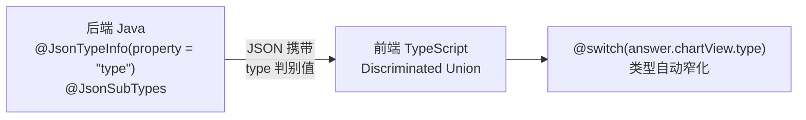

# Jackson 多态序列化与 TypeScript 联合类型

> 适用于后端枚举驱动的图表类型分发 → Jackson `@JsonTypeInfo` 多态 + 前端 discriminated union 的模式。
> 目标：删除后端 `enum` + `chartType` 字段，改用抽象基类 + `@JsonProperty("type")` 实现自动分发。



---

## 一、问题场景

后端接口返回 JSON 中包含一个"类型"字段，前端根据该类型渲染不同的组件：

```java
// ❌ 旧模式：枚举 + switch
public record MetricAnswer(ChartType chartType, ...) {}
public enum ChartType { METRIC_CARD, LINE_CHART, BAR_CHART, PIE_CHART }

// 前端每次新增类型都需要：
// 1. 加 enum 值
// 2. 改 switch
// 3. 不在同一个地方维护
```

## 二、推荐模式：Jackson 多态序列化

### 2.1 后端

**步骤 1：定义抽象基类**

```java
@JsonTypeInfo(use = JsonTypeInfo.Id.SIMPLE_NAME, property = "type")
@JsonSubTypes({
    @JsonSubTypes.Type(value = MetricCardView.class, name = "MetricCardView"),
    @JsonSubTypes.Type(value = LineChartView.class, name = "LineChartView"),
    @JsonSubTypes.Type(value = BarChartView.class, name = "BarChartView"),
    @JsonSubTypes.Type(value = PieChartView.class, name = "PieChartView"),
})
public abstract class ChartView {}
```

- `property = "type"` — 序列化时自动在 JSON 中写入 `"type": "MetricCardView"` 等 discriminator
- `name = "..."` — discriminator 的值，应与 TypeScript 端 literal type 保持一致
- 新增类型只需：新建子类 + 注册到 `@JsonSubTypes`

**步骤 2：定义子类**

```java
@JsonInclude(Include.NON_NULL)
public class MetricCardView extends ChartView {
    private final String title;
    private final Object value;
    private final String unit;

    public MetricCardView(String title, Object value, String unit) {
        this.title = title;
        this.value = value;
        this.unit = unit;
    }
    // getters ...
}
```

```java
public class LineChartView extends ChartView {
    private final String title;
    @JsonProperty("xAxisName") private final String categoryAxisLabel;
    @JsonProperty("yAxisName") private final String valueAxisLabel;
    private final String seriesName;
    private final List<ChartDataPoint> dataPoints;
    // constructor + getters ...
}
```

> **💡 Import 说明：**
> - `@JsonTypeInfo`、`@JsonSubTypes`、`@JsonInclude` 来自 `com.fasterxml.jackson.annotation.*`
> - `@JsonInclude(Include.NON_NULL)` 需导入 `com.fasterxml.jackson.annotation.JsonInclude.Include`
> - 或在注解中写全路径 `@JsonInclude(JsonInclude.Include.NON_NULL)`，无需额外 import

**步骤 3：替换枚举字段**

```java
// ❌ 旧
public record MetricAnswer(ChartType chartType, ...) {}

// ✅ 新
public record MetricAnswer(ChartView chartView, ...) {}
```

- 业务逻辑构建时直接 `return new PieChartView(...)` 而非 `return ChartType.PIE_CHART`
- 删除 `ChartType` 枚举文件

### 2.2 前端（TypeScript）

**步骤 1：定义 Discriminated Union**

```typescript
interface BaseChartView {
  type: string;
}

export interface MetricCardView extends BaseChartView {
  type: 'MetricCardView';
  title: string;
  value: unknown;
  unit: string | null;
}

export interface LineChartView extends BaseChartView {
  type: 'LineChartView';
  title: string;
  xAxisName: string;
  yAxisName: string;
  seriesName: string;
  dataPoints: ChartDataPoint[];
}

export type ChartView = MetricCardView | LineChartView | BarChartView | PieChartView;
```

**步骤 2：MetricAnswer 中使用联合类型**

```typescript
export interface MetricAnswer {
  // ...
  chartView: ChartView | null;  // ✅ 联合类型自动窄化
}
```

**步骤 3：模板中使用 @switch**

```html
@if (answer.chartView) {
  @switch (answer.chartView.type) {
    @case ('MetricCardView') {
      <app-metric-card [answer]="answer" />
    }
    @case ('LineChartView') {
      <app-line-chart [chartData]="answer.chartData" />
    }
  }
}
```

## 三、最佳实践

| 要点 | 说明 |
|------|------|
| `property = "type"` | discriminator 字段名使用 `"type"`（简短、通用），而非 `"chartType"` |
| 前后端 value 一致 | `@JsonSubTypes.Type(name = "MetricCardView")` 与 TS `type: 'MetricCardView'` 的值必须一致 |
| Checkstyle 兼容 | Jackson 字段名与 getter 名可以不同：`@JsonProperty("xAxisName") private String categoryAxisLabel` |
| 共享 DTO | 子类共享的嵌套类型（如 `ChartDataPoint`）定义为独立 `record` 或类 |
| 判空安全 | 模板中 `@if (answer.chartView)` 保护空值（如错误响应时 chartView 为 null） |
| 不删除旧 DTO 层 | `ChartData`、`gridResults`、`singleResults` 等依然存在，chartView 是新增的视图抽象，并非替代所有响应字段 |
| 删除前确认引用 | 删除旧枚举前 MUST 搜索全项目 Java + TypeScript 引用，确认 0 引用后方可删除 |

## 四、效果对比

| 维度 | 旧模式（Enum） | 新模式（Polymorphism） |
|------|---------------|----------------------|
| 新增图表类型 | 枚举 + switch + 前端分支 | 新建子类 + 注册 `@JsonSubTypes` + TS 类型 |
| JSON 结构 | `{"chartType": "METRIC_CARD", ...}` | `{"chartView": {"type": "MetricCardView", ...}}` |
| TS 类型安全 | 手动维护 | 自动通过 discriminated union 窄化 |
| 后端字段数 | chartType + 具体数据各自校验 | chartView 自包含 |

## 五、设计决策说明

### 5.1 `property` 选择 `"type"` 而非 `"chartType"`

| 候选 | 理由 | 结论 |
|------|------|------|
| `"type"` | 简短通用，多态基类职责就是描述"是什么类型"，与低代码项目 (`DatasetDto`) 一致 | ✅ |
| `"chartType"` | 业务含义明确，但限制了基类的可复用性。未来其他多态场景（如 `DataSourceConnector`）需要不同字段名 | ❌ |
| `"kind"` | Jackson 社区惯例使用 `"type"`，不应引入不必要的差异 | ❌ |

### 5.2 discriminator 策略使用 `SIMPLE_NAME`

| 候选 | 理由 | 结论 |
|------|------|------|
| `SIMPLE_NAME` | 子类简名自描述，无需额外常量文件 | ✅ |
| `CLASS_NAME` | 全限定名过长，JSON 中不可读且暴露包结构 | ❌ |
| `CUSTOM` | 需要 `@JsonTypeIdResolver`，增加复杂度 | ❌ |

### 5.3 使用 `@JsonSubTypes` 而非自定义序列化器

`@JsonSubTypes` 是 Jackson 原生支持，注解式声明最直观。`@JsonTypeIdResolver` 或自定义 `JsonSerializer` 提供更灵活的控制但需要大量模板代码，适用于更复杂的动态注册场景而非当前已知类型场景。

### 5.4 前端 Discriminated Union 而非 Enum

TypeScript union type + `type` literal 可直接利用 `@switch` 的类型窄化能力，无需手动编写类型守卫函数。这与后端 enum 模式的维护成本形成鲜明对比。

### 5.5 Checkstyle 冲突：`@JsonProperty` 解耦而非禁用规则

| 候选 | 理由 | 结论 |
|------|------|------|
| `@JsonProperty("xAxisName") private String categoryAxisLabel` | 字段名合规，getter 合规，JSON 输出保留 `xAxisName` | ✅ |
| 禁用 Checkstyle `ParameterNameCheck` | 全局禁用降低代码规范性 | ❌ |

### 5.6 Decoder 对象保持 record

如 `MetricAnswer` 是 Java record，不能继承。改造方案为直接替换字段类型（`ChartType chartType` → `ChartView chartView`），record 紧凑语法不受影响。构建逻辑从 `determineChartType()` 改为 `buildChartView()` 并返回具体子类。
