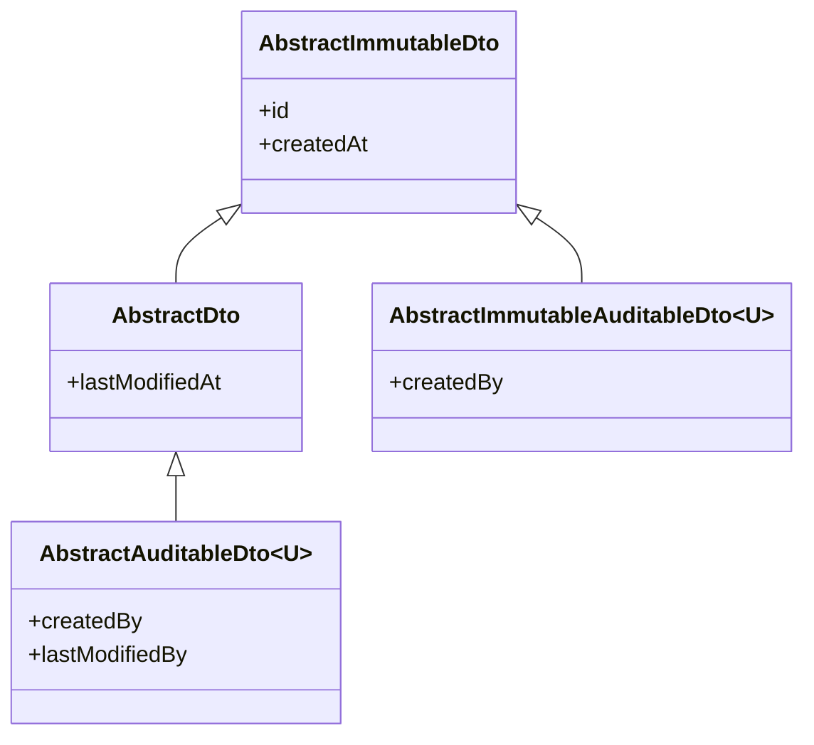

# 后端 DTO/MapStruct 示例

---

## 1. DTO 层次

DTO 层次镜像实体层次，基类定义通用字段：



`<U>` 为解析后的用户对象类型（如 `UserSummaryDto`），与实体的 `Long createdById` 不同。

---

## 2. DTO 定义

### 读 DTO（@Value，不可变）

```java
@Value
public class FormSummaryDto extends AbstractDto {
  String title;
  boolean approvalEnabled;
}

// 含审计字段：<U> 为 UserSummaryDto
@Value
public class FormResponseDto extends AbstractAuditableDto<UserSummaryDto> {
  Long formId;
  Map<String, Object> data;
}
```

### 写 record（可变，独立于读 DTO）

```java
public record CreateFormRequest(boolean approvalEnabled) {}

public record UpdateFormRequest(
    @NotBlank String title,
    @Valid PrintConfigDto printConfig,
    @NotEmpty List<@Valid FormActionDto> actions) {}
```

---

## 3. MapStruct Mapper

### 基础 Mapper

```java
@Mapper(config = MapStructConfig.class, uses = { FormRevisionMapper.class, FormItemMapper.class })
public interface FormMapper {
  FormMapper INSTANCE = Mappers.getMapper(FormMapper.class);

  FormSummaryDto mapToSummary(Form form);
  FormDetailsDto mapToDetails(Form form);
}
```

### 嵌套子映射（uses）

包含关联实体的 Mapper 通过 `uses` 组合子 Mapper，MapStruct 自动递归映射：

```java
// 父 Mapper：声明依赖子 Mapper
@Mapper(config = MapStructConfig.class, uses = DataObjectFieldMapper.class)
public interface DataObjectMapper {
  DataObjectMapper INSTANCE = Mappers.getMapper(DataObjectMapper.class);

  DataObjectSummaryDto mapToSummary(DataObject entity);
  DataObjectDetailsDto mapToDetails(DataObject entity);
}

// 子 Mapper：处理嵌套字段
@Mapper(config = MapStructConfig.class)
public interface DataObjectFieldMapper {
  DataObjectFieldMapper INSTANCE = Mappers.getMapper(DataObjectFieldMapper.class);

  DataObjectFieldDto mapToDto(DataObjectField field);
}
```

当 `DataObject` 包含 `List<DataObjectField> fields` 时，`DataObjectMapper` 自动通过 `DataObjectFieldMapper` 映射到 `List<DataObjectFieldDto>`，无需额外配置。

### 命名约定

| 方法名 | 用途 |
|--------|------|
| `mapToSummary(entity)` | 精简 DTO（列表用） |
| `mapToDetails(entity)` | 完整 DTO（详情用） |

---

## 4. MapStructConfig

```java
@MapperConfig(
    subclassExhaustiveStrategy = SubclassExhaustiveStrategy.RUNTIME_EXCEPTION)
public interface MapStructConfig {}
```
