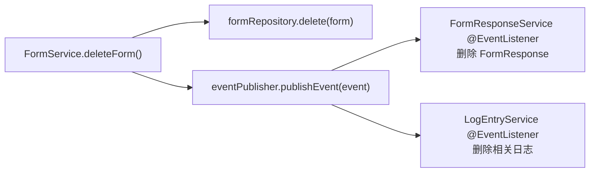
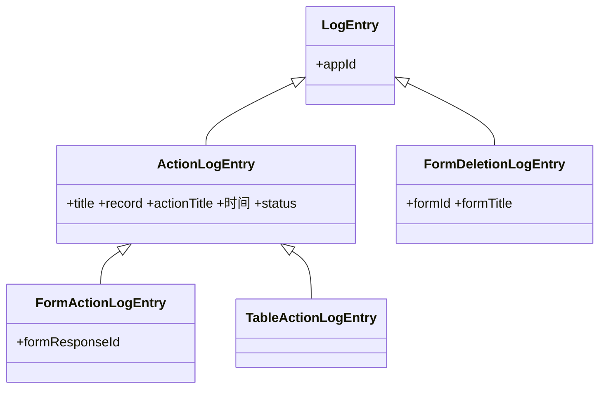
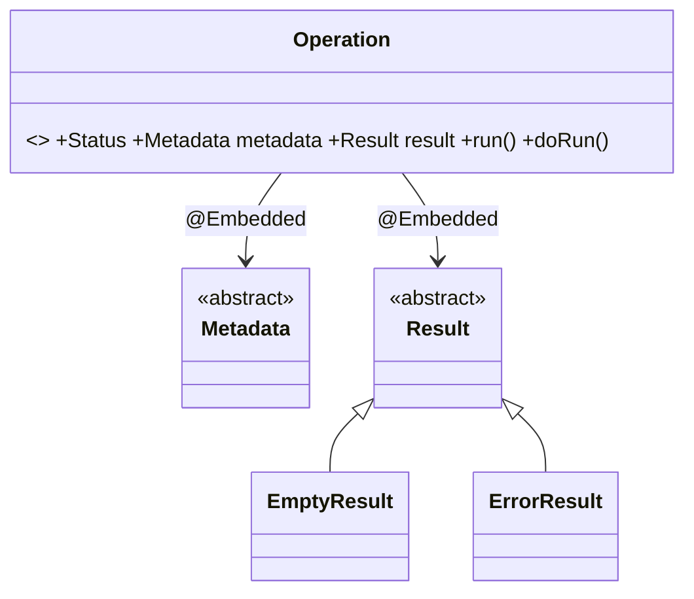

# 后端 Service/Entity/Repository 示例

## 1. Service（getEntity 模式 + @Transactional）

```java
@Service
@AllArgsConstructor
public class FormService {
  private final FormRepository formRepository;
  private final ApplicationService appService;

  public FormDetailsDto getForm(Long appId, Long formId) {
    return FormMapper.INSTANCE.mapToDetails(getFormEntity(appId, formId));
  }

  public Form getFormEntity(Long appId, Long formId) {
    return formRepository.findByIdAndAppId(formId, appId).orElseThrow(
        () -> new NotFoundException("表单不存在", new ResourceInfo("Form", formId)));
  }

  @Transactional
  public FormDetailsDto createForm(Long appId, CreateFormRequest request) {
    var app = appService.getApplicationEntity(appId);
    var form = new Form("新的表单", request.approvalEnabled(), app.getId());
    return FormMapper.INSTANCE.mapToDetails(formRepository.save(form));
  }

  @Transactional
  public void deleteForm(Long appId, Long formId) {
    formRepository.delete(getFormEntity(appId, formId));
  }
}
```

## 2. Repository（多租户感知）

```java
public interface FormRepository extends JpaRepository<Form, Long> {
  List<Form> findAllByAppId(Long appId);
  Optional<Form> findByIdAndAppId(Long id, Long appId);

  @Query("""
      select distinct f from Form f
      left join fetch f.revisions r
      left join fetch r.items
      where f.id = ?1 and f.appId = ?2
      """)
  Optional<Form> findByIdAndAppIdWithRevisionsAndItems(
      @Param("id") Long id, @Param("appId") Long appId);
}
```

## 3. 实体

| 场景 | 基类 |
|------|------|
| 普通多租户，可变 | `AbstractTenantAwareEntity` |
| 多租户 + 审计字段 | `AbstractTenantAwareAuditable` |
| 多租户，不可变 + 审计 | `AbstractTenantAwareImmutableAuditable` |
| 非租户实体（极少） | `AbstractEntity` 或 `AbstractAuditable` |

```java
@Entity
@Table(name = "app_form", indexes = { @Index(columnList = "app_id") })
@NoArgsConstructor(access = AccessLevel.PROTECTED)
public class Form extends AbstractTenantAwareEntity {
  @NotBlank @Column(nullable = false)
  private String title;
  @Column(name = "approval_enabled", nullable = false)
  private boolean approvalEnabled;
  @Column(name = "app_id", nullable = false)
  private Long appId;
  @OneToMany(mappedBy = "form", cascade = CascadeType.ALL, orphanRemoval = true)
  private List<FormRevision> revisions = new ArrayList<>();

  @Default
  public Form(Long id) { super(id); }

  public Form(String title, boolean approvalEnabled, Long appId) {
    this.title = title; this.approvalEnabled = approvalEnabled; this.appId = appId;
  }
}
```

## 4. 事件驱动级联删除

跨 Service 的关联数据清理通过事件驱动解耦。三个原则：谁删除谁发布事件，谁清理谁监听事件，事件参数最小化。



```java
// 发布方
@Service @AllArgsConstructor
public class FormService {
  private final ApplicationEventPublisher eventPublisher;

  @Transactional
  public void deleteForm(Long appId, Long formId) {
    var form = getFormEntity(appId, formId);
    formRepository.delete(form);
    eventPublisher.publishEvent(new FormDeletedEvent(appId, formId, form.getTitle()));
  }
}

// 事件类（@Getter @AllArgsConstructor，private final 不可变）
@Getter @AllArgsConstructor
public class FormDeletedEvent {
  private final Long appId;
  private final Long formId;
  private final String formTitle;
}

// 监听方（各自处理自己的数据范围）
@Service
public class FormResponseService {
  @EventListener @Transactional
  public void handleFormDeletedEvent(FormDeletedEvent event) {
    formResponseRepository.deleteByFormId(event.getFormId());
  }
}
```

事件发布注意事项：事件参数顺序 `appId` → 父级 ID → 自身 ID → name；监听方法加 `@Transactional`；事务提交后事件才派发。

## 5. Reference Contributor 模式

删除资源前查询哪些其他资源引用了它。完整代码示例见 [`contributor-pattern.md`](contributor-pattern.md)。

## 6. 日志实体继承

所有日志使用 `SINGLE_TABLE` 策略，统一存储在 `log_entry` 表：



```java
@Entity @NoArgsConstructor(access = AccessLevel.PROTECTED) @Getter
public class FormDeletionLogEntry extends LogEntry {
  private Long formId;
  private String formTitle;

  public FormDeletionLogEntry(Long appId, Long formId, String formTitle) {
    super(appId);
    this.formId = formId; this.formTitle = formTitle;
  }
}
```

关键规则：新日志类型继承 `LogEntry`，不直接继承 `AbstractTenantAwareImmutableAuditable`；构造函数调 `super(appId)`；`createdById` 由 `AuditingEntityListener` 自动填充；新增字段在 Liquibase 中 `nullable = true`。

## 7. 长时运行异步操作（AIP-151）

耗时操作（如 CSV 导入）通过 `Operation` 抽象实体 + `@DomainEvents` 模式实现异步状态管理：



```java
@Service @AllArgsConstructor
public class DictionaryItemService {
  private final Validator validator;

  @Transactional
  public OperationDto importDictionaryItems(Long appId, Long dictId, MultipartFile file) {
    var items = parseCsvFile(file);
    List<String> messages = validateItems(items);
    if (!messages.isEmpty()) {
      return new ImportDictionaryItemsOperationDto(/* ... */);
    }
    repository.saveAll(items);
    return new ImportDictionaryItemsOperationDto(/* ... */);
  }
}
```

关键规则：校验失败返回 `Status.FAILED` + 错误信息，不抛异常；`@DomainEvents` 在实体保存后自动派发；`@Embedded Metadata` / `Result` 支持子类型多态。DTO 层次使用 `@JsonTypeInfo` + `@JsonSubTypes` 实现多态 JSON 序列化。
