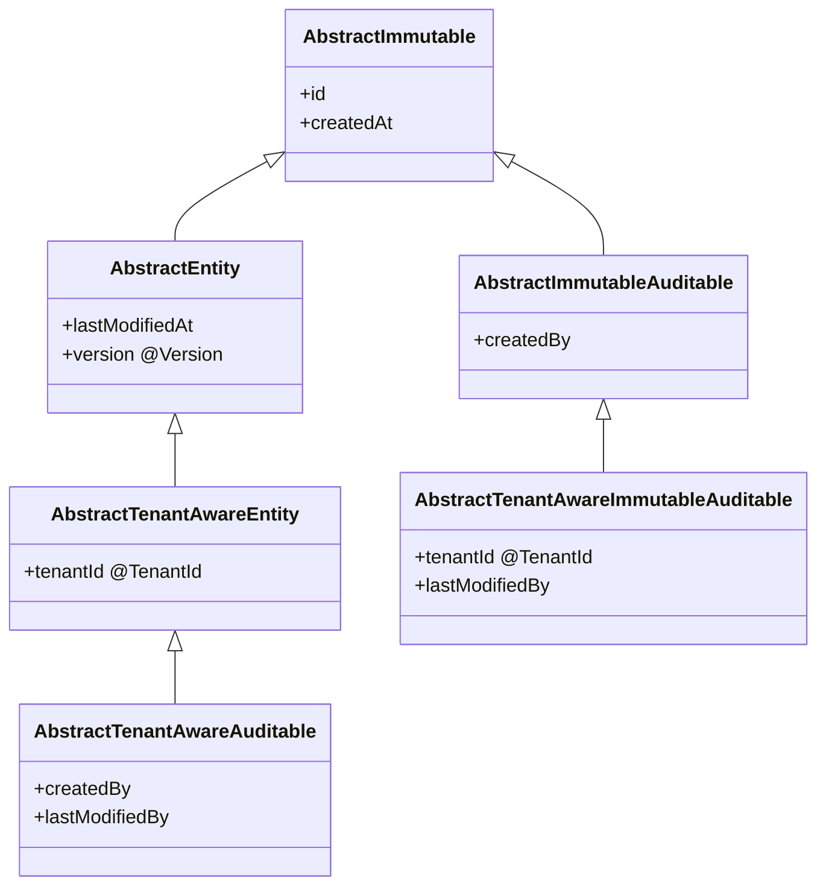

# Hibernate / JPA 规范

按需加载。仅当需要编写对应组件类型时阅读相关章节。

## 速查

| 场景 | 决策 |
| --- | --- |
| 新建实体 | 继承 `AbstractTenantAwareEntity` 或 `AbstractTenantAwareAuditable` |
| 实体 `@Table` 命名 | 小写蛇形复数，如 `app_forms` |
| 审计字段 | `createdById` 由 `AuditingEntityListener` 自动填充 |
| 日志实体 | 继承 `LogEntry`（SINGLE_TABLE），不直接继承基类 |
| `open-in-view` | 设为 `false` |

## 概述

使用 Hibernate 作为 JPA 实现进行对象关系映射。

## Entity 规范

```java
@Entity
@Table(name = "users")
@NoArgsConstructor(access = PROTECTED)
@Getter
@SuperBuilder
public class User extends AbstractAuditable {

  @Id
  @GeneratedValue(strategy = GenerationType.IDENTITY)
  private Long id;

  @Column(nullable = false, length = 100)
  private String name;

  @Column(unique = true, nullable = false)
  private String email;

  @ManyToOne(fetch = LAZY)
  @JoinColumn(name = "department_id")
  private Department department;

  @OneToMany(mappedBy = "user", cascade = ALL, orphanRemoval = true)
  private List<Order> orders = new ArrayList<>();
}
```

**规则：**
- 继承正确的基类（参见「实体/DTO 层次」章节）
- 三件套：`@Entity` + `@NoArgsConstructor(access = PROTECTED)`（final 字段加 `force = true`），`@Getter` 类级别或字段级别，`@SuperBuilder` 按需使用
- `@Table(name = "...")` 命名：小写蛇形，复数
- 字段用 `@Column(nullable = false)` 等约束
- 关联关系：多租户实体间的关联用 `@ManyToOne(fetch = LAZY)` + `@JoinColumn(name = "...")`，避免 EAGER
- 日志实体继承 `LogEntry`（SINGLE_TABLE），不要直接继承 `AbstractTenantAwareImmutableAuditable`
- `createdById` 由 `AuditingEntityListener` 自动填充，构造函数不需要传递

## 实体/DTO 层次



- 所有实体使用 Lombok（`@Getter`、`@NoArgsConstructor`、`@SuperBuilder` 按需使用）和 `@MappedSuperclass`。
- 每个实体有独立的数据库序列，`incrementBy=50`（匹配 Hibernate 默认序列优化）。
- 审计字段由 `AuditingConfig` 通过 Spring Security `SecurityContextHolder` 自动填充。

**后端 DTO**
`AbstractImmutableDto` / `AbstractDto` / `AbstractImmutableAuditableDto` / `AbstractAuditableDto` 对应实体层次。`PagedResponse<T>` 统一分页响应（`items` + `totalItems`）。

> 完整集成示例（含 Service + Entity + Repository）见框架维度的 `examples/service-entity.md`。

## 关系映射

| 关系 | 注解 | Fetch 策略 | 使用场景 |
|------|------|-----------|---------|
| 多对一 | `@ManyToOne` | LAZY (默认) | 子→父引用 |
| 一对多 | `@OneToMany` | LAZY (默认) | 父→子集合 |
| 一对一 | `@OneToOne` | LAZY (显式) | 用户→档案 |
| 多对多 | `@ManyToMany` | LAZY (显式) | 用户→角色 |

## 查询

### JPQL / Criteria

```java
@Repository
public interface UserRepository extends JpaRepository<User, Long> {

  // 方法命名查询
  List<User> findByDepartmentId(Long departmentId);

  // JPQL
  @Query("SELECT u FROM User u WHERE u.email LIKE :domain")
  List<User> findByEmailDomain(@Param("domain") String domain);

  // 更新操作
  @Modifying
  @Query("UPDATE User u SET u.active = false WHERE u.lastLogin < :date")
  int deactivateInactiveUsers(@Param("date") LocalDateTime date);
}
```

### EntityGraph (N+1 问题)

```java
@Entity
@NamedEntityGraph(name = "User.orders", attributeNodes = @NamedAttributeNode("orders"))
public class User { ... }

// Repository
@Query("SELECT u FROM User u WHERE u.id = :id")
@EntityGraph("User.orders")
Optional<User> findByIdWithOrders(@Param("id") Long id);
```

## 最佳实践

- ✅ `open-in-view: false`（避免懒加载异常掩盖性能问题）
- ✅ `ddl-auto: validate`（生产环境不做自动 DDL）
- ✅ 使用 `@DynamicUpdate` 优化更新语句
- ❌ 避免 EAGER fetch（一律使用 LAZY + EntityGraph）
- ❌ 避免在循环中查询数据库（批量使用 `findAllById` / `IN` 查询）
