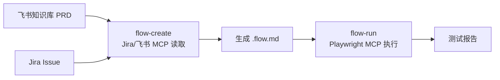

# Sweep — 测试侧套件

> DeepStorm 测试侧套件，基于 Playwright MCP 的 E2E 测试流程管理工具。

## 定位

Sweep 帮助测试工程师在 AI 编程时代用工程化方法管理 E2E 测试流程。采用 .flow.md 测试意图文档驱动模式——用自然语言描述测试流程，通过 Playwright MCP 直接执行，不再需要维护传统的 Playwright 测试代码文件。

核心流程：**OpenSpec 管理变更 → .flow.md 描述流程 → Playwright MCP 执行验证**

## Skill 列表

| 命令 | Skill | 说明 |
|------|-------|------|
| `/sweep-init` | setup | 初始化 E2E 测试项目：Playwright + MCP + 目录结构 |
| `/sweep-plan` | flow-create | 交互式生成 .flow.md 测试意图文档 |
| `/sweep-run` | flow-execution | 通过 Playwright MCP 执行 .flow.md 并输出报告 |

## E2E 项目结构

初始化后的 E2E 测试项目骨架：

```
{e2e-project}/
├── flows/
│   ├── topology.yaml        # 功能模块拓扑定义
│   ├── user-system/         # 按模块层级组织
│   │   └── login.flow.md
│   ├── payment/
│   │   └── checkout.flow.md
│   └── reports/             # 执行报告
├── scripts/
│   └── flow-selector.mjs    # 层级选择工具（@inquirer/checkbox）
├── playwright.config.ts
├── .env                     # 环境配置（gitignored）
├── package.json
└── tsconfig.json
```

## 工作流



## SDD 工具链

| 工具 | 用途 |
|------|------|
| **OpenSpec** | 变更管理（proposal → specs → design → tasks → apply → verify → archive） |
| **Grill-me** | 测试场景 Review 和质量把关 |
| **Playwright MCP** | 浏览器自动化执行 |


### MCP 服务器依赖

所有 MCP 配置在**项目根目录**统一管理，通过 CLI 安装向导选择所需服务。

| 服务器 | 域 | 所需环境变量 | 用途 |
|--------|-----|-------------|------|
| `jira` | project-management | `DEEPSTORM_JIRA_TOKEN` | 读取 Jira Issue 获取测试需求 |
| `feishu-wiki` | knowledge-base | `DEEPSTORM_FEISHU_TOKEN` | 读取 PRD 飞书文档补充测试上下文 |
| `github` | code-hosting | `DEEPSTORM_GITHUB_TOKEN` | CI 集成与 Issue 管理 |

> ⚠️ **Playwright MCP** 不由 CLI 安装向导管理——`/sweep-init` 会在初始化 E2E 测试项目时自动配置为 WebSocket 连接（`ws://localhost:54321`）。

---

## 开发

### 环境搭建

参见 `docs/deepstorm-development.md`。

### 依赖管理

```bash
pnpm install
```
