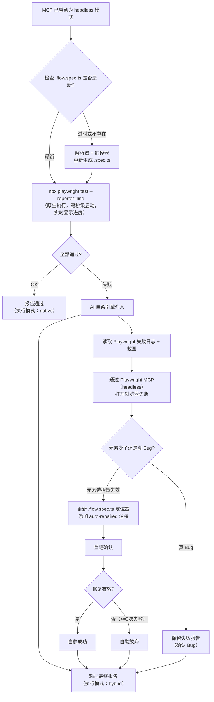
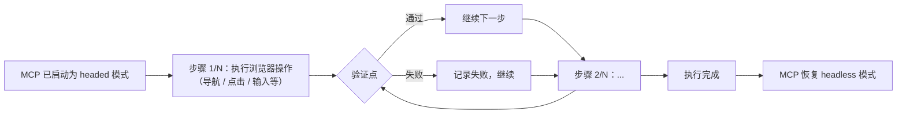

# Sweep Flow Run — 测试流程执行

读取 .flow.md 测试意图文档，根据项目配置的 E2E 框架，通过对应 MCP 服务逐步骤操作浏览器执行测试流程，验证每个步骤的预期结果。

---

## 使用方式

```bash
/sweep-run                              # 交互式选择（默认：混合执行 - 原生 Playwright + AI 自愈）
/sweep-run --all                         # 全量执行（默认：混合执行）
/sweep-run --all --browser               # 全量执行 + 打开浏览器窗口逐步骤调试
/sweep-run --all --no-parallel           # 全量执行 + 批量模式（单线程，仅适用于原生执行）
/sweep-run --all --native                # 全量执行 + 纯原生模式（失败不自愈，仅供调试）
/sweep-run --path user-system            # 按模块路径
/sweep-run flows/login.flow.md           # 单文件
/sweep-run flows/login.flow.md --flow L02  # 单 Flow
/sweep-run --env staging                 # 指定测试环境
```

### 执行模式说明

| 模式 | 参数 | MCP 模式 | 说明 | 加速比 |
|------|------|---------|------|--------|
| **混合执行（默认）** | （无）或 `--fast` | headless | 预编译 `.flow.spec.ts` → 原生 Playwright 执行（`--reporter=line`）；失败 AI 自愈 | ~10-20x |
| 纯原生（不自愈） | `--native` | 不启动 | 只用原生 Playwright 执行，失败不自愈 | ~20x |
| 批量（单线程） | `--no-parallel` | headless | 原生执行 + 单线程顺序运行 | ~10x |
| 浏览器调试 | `--browser` | headed | AI 逐步骤 MCP 调用 + 浏览器窗口可见 | 1x |

---

## 工作流

### 前置检查：读取框架配置

在执行前，先读取 `.deepstorm/settings.json` → `sweep.e2eFramework` 配置，确定当前项目使用的 E2E 框架。

```bash
node scripts/env-manager.mjs --framework
```

```json
{"framework":"playwright","source":"deepstorm-settings"}
```

- **playwright** → 通过 Playwright MCP（`deepstorm-playwright`）执行浏览器操作
- **null** → 提示"E2E 框架未配置，请运行 deepstorm setup 重新配置"并退出

---

### 步骤 1：检查初始化状态与路径导航

从 `.deepstorm/settings.json` 读取 `sweep.e2eProjectPath`，确定 E2E 测试项目的位置。

```bash
node scripts/env-manager.mjs --project-root
# 输出: {"found":true,"path":"/abs/path/to/project"}
```

#### 1.1 配置存在 → 路径导航

- **WHEN** `--project-root` 输出 `found: true`
- **THEN** 读取 `sweep.e2eProjectPath`：
  ```bash
  E2E_PATH=$(grep -o '"e2eProjectPath"[^,]*' \
    "$(node scripts/env-manager.mjs --project-root | \
      node -pe "JSON.parse(require('fs').readFileSync('/dev/stdin','utf8')).path")/.deepstorm/settings.json" \
    | head -1 | cut -d'"' -f4)
  ```

#### 1.2 配置不存在 → 报错退出

- **WHEN** `--project-root` 输出 `found: false`
- **THEN** 提示"❌ 未检测到深风项目。请先运行 deepstorm setup。"并退出

---

### 步骤 2：确定执行范围

根据用户输入参数或交互选择，确定要执行的 .flow.md 文件列表。

#### 2.1 交互模式（无参数） — 对话式选择

不使用 `@inquirer/checkbox` 交互选择器（在 Claude Code 环境中 TTY/TUI 不可靠），改为**对话式选择**：

1. 运行 `node scripts/flow-selector.mjs --list` 获取可用 .flow.md 文件列表
2. 检查输出是否为有效 JSON（含 `files[]`），若脚本报错则提示用户后退出
3. 在消息中直接列出可用文件供用户选择，参考格式：

   ```markdown
   📋 可用测试模块：

     1. user-system/register（3 个用例：L01-L03）
     2. user-system/login（2 个用例：L01-L02）
     3. tasks/crud（4 个用例：T01-T04）

   请选择：全部执行 / 输入序号（如 1,3） / 输入模块名
   ```

4. 等待用户在聊天中回复选择
5. 根据用户选择，直接写入 `.sweep-selection.json`：
   - **全部执行** → `{"type":"all"}`
   - **指定文件全部 Flow** → `{"type":"selection","files":[{"file":"/abs/path/to/file.flow.md","flows":[],"all":true}]}`
   - **指定文件的特定 Flow** → `{"type":"selection","files":[{"file":"/abs/path/to/file.flow.md","flows":["L01"],"all":false}]}`
6. 输出选中文件的总览，确认后继续执行（**以下为示例格式，实际内容根据项目动态生成**）：

```
选中的模块：user-system, tasks

将要执行：
  flows/user-system/register.flow.md（3 个 Flow）
  flows/tasks/task-crud.flow.md（4 个 Flow）

确认开始执行？(y/n)
```

#### 2.2 直接参数模式

| 参数 | 行为 | 示例 |
|------|------|------|
| `--all` | 执行 flows/ 下所有 .flow.md | `/sweep-run --all` |
| `--path {module}` | 执行指定模块路径下的所有 .flow | `/sweep-run --path user-system/login` |
| `{file-path}` | 执行指定文件 | `/sweep-run flows/login.flow.md` |
| `{file-path} --flow {ID}` | 只执行文件中的某个 Flow | `/sweep-run login.flow.md --flow L02` |
| `--env {env}` | 切换目标环境 | `/sweep-run --all --env staging` |
| `--browser` | 打开浏览器窗口逐步骤调试 | `/sweep-run --all --browser` |
| `--no-parallel` | 使用批量但不并行 | `/sweep-run --all --no-parallel` |

#### 2.3 文件不存在处理

如指定的文件或 --path 不存在：
- 提示"指定路径不存在"
- 读取 topology.yaml 展示可用模块
- 引导用户重新选择

#### 2.4 自动编译（含 freshness 检查）

对每个待执行文件运行编译器，由脚本自动判断是否需要重新编译（若 `.flow.spec.ts` 已是最新则跳过）：

```bash
node scripts/spec-compiler.mjs <path-to-flow.md>
```

脚本输出 `⏭ SKIP`（跳过）或 `✅ Generated`（新编译）。

---

### 步骤 3：解析 .flow.md

对于每个待执行的 .flow.md 文件，按以下结构解析。**注意：混合执行模式下解析由 `flow-parser.mjs` 自动完成，AI 仅需在编译失败或 `--browser` 模式下人工阅读理解。**

```
文件头：功能名称、来源、创建时间
场景清单：[{ID, 场景, 类型, 优先级}, ...]
Flows数组：
  [{ID, 标题, 前置条件, 步骤: [{序号, 描述, 验证点}], 环境要求}]
```

提取每个 Flow 中的：
- 前置条件（描述性文本，用于理解上下文）
- 步骤列表（有序操作 + 验证点）
- 环境要求（用于 --env 默认值）

---

### 步骤 4：配置目标环境

#### 4.1 读取 --env 参数

通过 `env-manager.mjs` 解析目标环境：

```bash
node scripts/env-manager.mjs --env staging
```

输出示例：

```json
{"env":"staging","baseUrl":"https://staging.example.com","availableEnvs":[
  {"name":"test","key":"BASE_URL_TEST","url":"https://test.example.com"},
  {"name":"staging","key":"BASE_URL_STAGING","url":"https://staging.example.com"}
]}
```

- `--env staging` → 从 `settings.json` 的 `sweep.environments.staging` 读取
- `--env test` → 从 `settings.json` 的 `sweep.environments.test` 读取
- 不传参 → 使用 `settings.json` 的 `sweep.environments.default`，未设置则默认 `test`

#### 4.2 设置环境变量

```bash
export BASE_URL=$(node scripts/env-manager.mjs --env test --print 2>/dev/null | tail -1 | cut -d= -f2-)
```

或从 JSON 结果提取：
```bash
BASE_URL=$(node scripts/env-manager.mjs --env test | node -pe "JSON.parse(require('fs').readFileSync('/dev/stdin','utf8')).baseUrl")
```

#### 4.3 环境不存在处理

如果 `baseUrl` 为 `null`（指定的环境在 settings.json 中找不到对应配置）：

- 提示"未找到 [{env}] 环境的 baseURL 配置"
- 列出 `availableEnvs` 中已有的环境
- 引导用户选择已有环境或退出

---

### 步骤 5：MCP 服务管理

在执行前确认配置存在并按执行模式启动 MCP 服务。

#### 5.1 确认 MCP 可用性

```bash
node scripts/env-manager.mjs --check-mcp
```

输出示例：`{"available":true,"mcpName":"deepstorm-playwright"}`

- **`available: true`** → MCP 服务已配置，继续执行
- **`available: false`** → 提示"对应框架的 MCP 服务未配置。请运行 deepstorm setup 并选择对应 MCP 服务。"并退出

#### 5.2 启动 MCP 服务

通过 `mcp-manager.mjs` 根据执行模式（见执行模式说明表格）自动管理：

```bash
# headless 模式（默认）：MCP 仅用于自愈诊断
node scripts/mcp-manager.mjs --mode=headless

# headed 模式：浏览器调试
node scripts/mcp-manager.mjs --mode=headed

# 跳过 MCP（--native 模式）
node scripts/mcp-manager.mjs --mode=skip
```

输出 JSON：
```json
{"action":"started","mode":"headless","pid":12345,"port":54321}
```

`action` 取值：`started`（新启动）/ `already-ok`（已在正确模式）/ `switched`（切换后重启）/ `skipped`（跳过）。

#### 5.3 停止 / 检查状态

```bash
node scripts/mcp-manager.mjs --stop
node scripts/mcp-manager.mjs --status
```

---

### 步骤 6：执行测试

根据选择的执行模式执行测试流程。

#### 6.1 混合执行（默认）

**适用场景：** 日常执行，兼顾速度和容错。



**并行策略：** 依赖 Playwright 内置多 worker 并行（默认 = CPU 核数）。**所有 spec 文件统一通过单个 `npx playwright test` 命令执行**，不得拆分为多 Agent 或后台任务。Playwright 自身的 worker 池已实现了跨文件的并行执行，速度与手动拆分相当，且用户能实时看到每行测试结果输出。

**执行命令：** 必须使用 `--reporter=line,json`（逗号分隔，两个 reporter 同时启用），line 用于终端实时显示每个测试的开始和结果，json 用于程序化解析测试结果：

```bash
# 前台执行，不跑后台，确保用户能看到实时输出
npx playwright test --reporter=line,json <spec-path>
```

> ⚠️ **关键约束：** 必须直接在前台运行 `npx playwright test`，不得使用 `run_in_background: true` 或任何形式的后台/异步执行方式。用户需要看到 Playwright 逐条输出的测试进度（`[1/7] [chromium] › ... ✓`）。

> **注意：** CLI 上 `--reporter=json` 与 line 都输出到 stdout，解析 JSON 时需从末尾提取。如需分离输出，建议在 `playwright.config.ts` 中配置：`reporter: [['line'], ['json', { outputFile: 'results.json' }]]`

**自愈更新说明：** 当 AI 更新了 `.flow.spec.ts` 中的定位器后，会在文件中添加 `// auto-repaired: {timestamp}` 注释记录旧→新选择器的变化。

#### 6.2 纯原生模式（--native）

与混合执行相同使用 `.flow.spec.ts` 原生执行，但失败后不自愈。**注意：** 不启动 MCP 服务。

#### 6.3 浏览器调试模式（--browser）

浏览器窗口可见（headed），对每个 Flow 逐步骤执行。



**前置条件：** MCP 为 headed 模式（浏览器窗口可见）→ 打开浏览器 → 导航到 baseURL → 确保页面正常加载。

**操作类型：**

| 操作 | MCP 调用 | 验证方式 |
|------|---------|---------|
| 导航 | navigate/goto | 检查页面标题/URL |
| 点击 | click | 检查预期元素/状态变化 |
| 输入 | fill | 检查输入回显或后续页面状态 |
| 选择 | select | 检查选项是否生效 |
| 等待 | waitFor | 检查超时或条件满足 |

**执行完成后：** 杀掉 headed 进程，以 `--headless` 重启恢复默认模式。

#### 6.4 验证点检查

每个验证点对应一个断言检查。验证点失败则记录失败步骤，继续执行后续步骤。全部执行完成后汇总失败信息。**不中断执行。**

---

### 步骤 7：AI 自愈引擎

当混合执行的原生 Playwright 测试出现失败时，AI 自愈引擎介入诊断和修复。

**触发条件：** 仅默认模式（混合执行），原生执行有失败时自动触发。`--native` 不自愈，`--browser` 不经过原生执行。

**诊断流程：**

1. 读取 Playwright 失败日志（定位器、错误类型）
2. 提取失败上下文（失败的 test 块名称、步骤和验证点）
3. 通过 Playwright MCP（headless）打开浏览器诊断
4. AI 对比实际页面元素与 `.flow.spec.ts` 中的定位器

**判定与处理：**

| 判定结果 | 操作 | 报告中标注 |
|----------|------|-----------|
| **元素选择器失效**（元素存在但 CSS class/data-testid 变化） | 更新定位器；添加 `// auto-repaired: {timestamp} - {old} -> {new}` 注释；**重跑**确认 | 自愈成功 |
| **数据累积**（多次运行导致同名元素重复，`.first()`/`.last()` 选错目标） | 通过 `page.evaluate()` 调用 API 清理历史残留数据后重跑 | 自愈成功 |
| **真 Bug**（元素不存在、页面行为不符合预期） | 不修改 spec 文件 | 确认 Bug |
| **修复无效**（更新后重跑仍然失败） | 放弃修复 | 自愈放弃 |

**循环保护：** 同一 Flow 最多重试 **3 次**，超限则停止并保留最后一次失败报告。

---

### 步骤 8：输出测试报告

#### 8.1 终端实时输出

```
[14:30:01] 正在执行：user-system/login.flow.md
------------------------------------------
Flow: L01 - 正常登录成功

  OK 步骤 1/4：打开登录页面
     -> 验证：页面加载完成 v

  OK 步骤 2/4：输入邮箱
     -> 验证：输入框显示 v

  X 步骤 3/4：点击登录按钮
     -> 验证：URL 跳转到 /dashboard x
     期望：/dashboard
     实际：/login

  > 步骤 4/4：跳过（前置步骤失败）

------------------------------------------
汇总：1 flow, 1/3 通过, 1 失败, 1 跳过
```

#### 8.2 报告持久化

执行完成后，将完整报告写入 `flows/reports/{filename}-{timestamp}.report.md`：

```markdown
# 测试执行报告

**文件：** flows/user-system/login.flow.md
**执行时间：** 2026-06-13 14:30
**目标环境：** test (https://test.example.com)
**执行模式：** hybrid（原生执行 + AI 自愈修复）

---

## Flow: L01 - 正常登录成功 X

| 步骤 | 操作 | 验证 | 结果 |
|------|------|------|------|
| 1/4 | 打开登录页面 | 页面加载完成 | OK |
| 2/4 | 输入邮箱 | 输入框显示 | OK |
| 3/4 | 点击登录按钮 | URL 跳转 /dashboard | X |
| 4/4 | （跳过） | - | > |

### 失败详情

**步骤 3/4：** 点击登录按钮
- 期望：URL 跳转到 /dashboard
- 实际：URL 保持在 /login
- 可能原因：登录失败或页面未正确响应

---

## 汇总

| 项目 | 值 |
|------|-----|
| 总 Flow 数 | 1 |
| 总步骤数 | 3 |
| 通过 | 2 |
| 失败 | 1 |
| 跳过 | 1 |
| 通过率 | 66% |
```

#### 8.3 报告文件名格式

`{flow-file-name}-{YYYYMMDD}-{HHmm}.report.md`，示例：`login-20260613-1430.report.md`

---

## 检查清单

- [ ] 前置检查：框架配置已读取（`.deepstorm/settings.json` → `sweep.e2eFramework`）
- [ ] 项目已初始化（读取 settings.json → sweep.e2eProjectPath）
- [ ] 执行范围已确定（--all / --path / 交互选择）
- [ ] 执行模式已选择（hybrid / native / no-parallel / browser）
- [ ] MCP 服务按模式正确启动（available → headless / headed / 不启动）
- [ ] Freshness 检查：`.flow.spec.ts` 已是最新或重新编译
- [ ] 目标环境已配置（--env 或默认）
- [ ] 执行完成 + AI 自愈（如有失败）已执行
- [ ] 测试报告已输出（终端 + `flows/reports/*.report.md`）
- [ ] 报告中记录了执行模式与总用时
