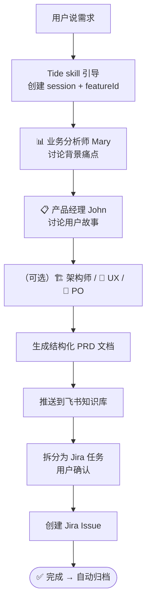

# Tide — 产品侧套件

**Tide**（潮汐）是 DeepStorm 产品侧套件，提供 **BMAD 多角色需求讨论** → **PRD 自动生成** → **飞书知识库/Jira 发布** 的全流程支持。

> 🌊 潮汐为珊瑚礁生态系统带来养分与动能——Tide 为整个产品开发链路提供结构化驱动力。

---

## 前置条件

使用 Tide 前需要先安装以下工具：

| 工具 | 版本要求 | 安装方式 |
|------|---------|---------|
| **Node.js** | ≥ 20.12 | [nodejs.org](https://nodejs.org) |
| **Python** | ≥ 3.10 | [python.org](https://www.python.org) |
| **uv** | 最新 | `curl -LsSf https://astral.sh/uv/install.sh \| sh` |
| **BMAD Method** | 最新 | `npx bmad-method install`（见下方） |
| **@deepstorm/cli** | 最新 | 通过 `npx @deepstorm/cli setup` 安装 Tide |

### 安装外部依赖

Tide 的工作流基于 **BMAD Method**（AI 驱动的敏捷开发框架），另推荐 **grill-me** 社区 skill 作为补充。Tide 自身不包含这些实现，需要用户单独安装：

| 依赖 | 类型 | 安装方式 |
|------|------|---------|
| **BMAD** （必要） | AI 敏捷开发框架 | `npx bmad-method install` |
| **grill-me** （推荐） | 需求追问辅助 skill | 从 [mattpocock/skills](https://github.com/mattpocock/skills) 复制 |

**BMAD：**
```bash
# 在项目目录下执行
npx bmad-method install
```
> 详细安装选项请参阅 [BMAD 官方文档](https://docs.bmad-method.org)。BMAD 是免费开源的，MIT 许可。

**grill-me（可选）：**
```bash
# 使用 skills CLI 安装
npx skills@latest add mattpocock/skills --skill grill-me
```
> grill-me 来自 [mattpocock/skills](https://github.com/mattpocock/skills) 社区集合，提供更好的需求追问体验，非必需。

## 安装 Tide

### 方式一：通过 CLI 安装向导（推荐）

```bash
npx @deepstorm/cli setup
```

安装向导会引导选择工具、配置凭据，自动完成 Tide skill 的复制和注册。

### 方式二：手动复制（开发者）

```bash
# 确认 Tide 的 skill 目录已被复制到 .claude/skills/
ls .claude/skills/tide-discuss/
```

安装后，在 Claude Code 中确认 Tide 已加载：

```
/help        # 应看到 `/tide` 等命令已注册
```

> **建议：** 在 DeepStorm 项目根目录下使用 Tide，可同步加载 DeepStorm 的其他基础技能和 MCP 配置。

## 快速使用

安装后，在 Claude Code 中直接口述需求即可触发 BMAD 工作流：

> "我想做一个企业微信扫码登录功能"

Claude 会自动识别需求，按 BMAD 流程依次与你讨论。

### 完整流程

1. **用户口述需求** → Tide 自动识别并激活
2. **BMAD 多角色讨论** → 分析师 (Mary) → 产品经理 (John) → 可选（架构师 / UX / PO）
3. **生成结构化 PRD** → 自动保存到 `tide-data/prds/`
4. **发布** → 推送到飞书知识库 / 创建 Jira Issue（需配置 MCP）
5. **归档** → 完结后自动归档到 `tide-data/archive/`

### 工作流



### 会话恢复

```text
恢复之前的 Tide 讨论
```
→ 自动列出可恢复的会话 → 选择继续或变更需求

---

## 项目结构

```
packages/tide/
├── skills/
│   └── tide-discuss/
│       ├── SKILL.md         # BMAD 工作流 skill（核心）
│       └── references/      # 参考文件
│           ├── data-format.md
│           ├── entry-details.md
│           ├── role-prompts.md
│           ├── checklists.md
│           ├── prd-template.md
│           ├── publish-flow.md
│           ├── session-ops.md
│           └── archive.md
├── README.md
└── package.json
```

### 运行时数据（在项目根目录自动创建）

```
tide-data/                   # 相对于 $PWD，自动创建
├── sessions/                # 未完结会话（active / prd_ready / published / publish_error）
│   └── .sequence            # 会话 ID 序列号
├── archive/                 # 已归档会话（completed / superseded，自动迁移）
└── prds/                    # PRD 快照（.md + .json）
```

---

## 数据存储

所有数据保存在项目根目录的 `tide-data/`，启动时自动创建。

| 文件 | 内容 |
|------|------|
| `tide-data/sessions/{sessionId}.json` | BMAD 讨论记录（含角色 checklist、publishChecklist） |
| `tide-data/sessions/.sequence` | 会话 ID 序列号 |
| `tide-data/archive/{sessionId}.json` | 已归档的完结会话 |
| `tide-data/prds/{sessionId}-prd.md` | PRD Markdown 快照 |
| `tide-data/prds/{sessionId}-prd.json` | PRD JSON 快照 |

会话状态流转：`active → prd_ready → published → completed → 归档`，发布失败时进入 `publish_error`，变更/放弃时进入 `superseded → 归档`。

---

## MCP 服务器配置

PRD 生成后的发布流程（知识库推送、Jira Issue 创建）依赖 MCP 服务器。Tide 现已支持 MCP 无关化架构——安装时通过 `mcpCapabilities` 声明所需能力域（knowledge-base、project-management），运行时根据 `deepstorm.mcpCapabilities` 动态判断可用服务。

> **💡 飞书上传开关：** 飞书知识库上传可通过 feature toggle 控制。如需关闭，在项目 `.claude/settings.local.json` 或 `.claude/settings.json` 中配置：
> ```json
> {
>   "deepstorm": {
>     "tide": {
>       "feishuUpload": {
>         "enabled": false
>       }
>     }
>   }
> }
> ```
> 默认开启（`true`），`settings.local.json` 优先级高于 `settings.json`。关闭后 Step 4a 被跳过，直接进入 4b 任务拆分。

MCP 配置通过 CLI 安装向导统一管理：

```bash
# 运行安装向导，选择 tide 工具和所需 MCP 服务
npx @deepstorm/cli setup
```

向导会自动：
1. 将选中的 MCP 服务配置合并到项目根目录的 `.mcp.json`
2. 在 `.env` 中创建环境变量占位（`DEEPSTORM_*` 前缀）
3. 安装对应的 MCP 使用指南 skill 到 `.claude/skills/`

> **详细配置指南**请参阅根目录 [README](../../README.md#mcp-服务器配置)。

Tide 用到的 MCP 服务器：

| 服务器 | 域 | 所需环境变量 | 用途 |
|--------|-----|-------------|------|
| **feishu-wiki** | knowledge-base | `DEEPSTORM_FEISHU_TOKEN` | 创建/读取飞书知识库文档 |
| **jira** | project-management | `DEEPSTORM_JIRA_TOKEN` | 发布 PRD 到 Jira Issue |


---

## 相关套件

| 套件 | 定位 | 类型 |
|------|------|------|
| [Reef](../reef/README.md) | 开发侧 — 代码实现、架构合规 | 套件 |
| [Sweep](../sweep/README.md) | 测试侧 — 测试生成、覆盖率、CI | 套件 |
| [Atoll](../atoll/README.md) | 运维侧 — 部署辅助、监控、故障排查 | 套件 |

---

## 许可

MIT &copy; 2026 DeepStorm Team
