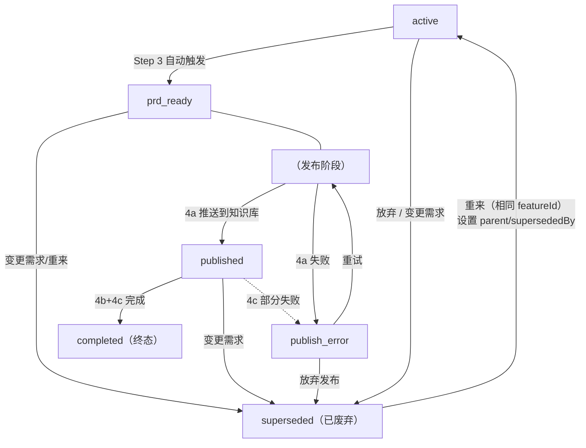

# 数据格式参考

## 会话 ID 格式

```
tide-YYYYMMDD-NNN
```

- YYYYMMDD = 当前日期
- NNN = 当日递增序列号（从 001 开始）
- 例：`tide-20260611-001`

**序列号维护：** `tide-data/sessions/.sequence` 文件记录上次序列号，格式为 `20260611 005`。首日没有此文件时从 001 开始。

**跨天处理：** 读取 `.sequence` 文件时，检查日期部分是否等于今天。如果日期不等于今天（跨天了），将 NNN 重置为 `001` 并从 `001` 开始。

**异常处理：** 如果 `.sequence` 文件内容损坏（格式错误、日期乱码等），**忽略该文件，重新生成**。基于当前 `sessions/` 目录中最大的 sessionId 序列号 + 1 计算新序列号。如果 `sessions/` 为空，从 001 开始。

---

## Feature ID 格式

```
MODULE-FUNCTION-SUBFUNCTION
```

全大写 + 连字符，例：`AUTH-LOGIN-WECOM`、`PAYMENT-ORDER-REFUND`。

**自动生成规则（当用户未指定时）：**
1. 先将需求描述**翻译成英文**，准确表达原意
2. 从英文翻译中提取 2-4 个核心关键词，按逻辑层级排列：`模块-功能-子功能`
3. 如果需求跨多个领域，取最核心的意图

> 例如：用户说"添加企业微信扫码登录" → 翻译为 "Add WeChat Work QR code login" → 提取 `AUTH-LOGIN-WECOM`
> 用户说"优化商品列表的加载速度" → 翻译为 "Optimize product list loading speed" → 提取 `PRODUCT-LOAD-OPTIMIZE`

**长度限制：** featureId 不超过 **5 个英文单词**（`AUTH-LOGIN-WECOM` 计为 3 个，`PAYMENT-ORDER-REFUND-V2` 计为 4 个）。

**备选机制：** 如果 AI 对提取哪 2-4 个词拿不准，提供 **2-3 个备选方案**让用户选择，不要自己做主。

**原则：** 生成的 featureId 要能让人一眼看出需求意图，不要用无意义的 hash 或过短的缩写。

---

## Session JSON 格式

```json
{
  "sessionId": "tide-20260611-001",
  "featureId": "AUTH-LOGIN-WECOM",
  "brief": "企业微信扫码登录",
  "createdAt": "2026-06-11T10:00:00.000Z",
  "status": "completed",
  "parent": null,
  "supersededBy": null,
  "services": {
    "knowledgeBase": {
      "provider": "feishu-wiki",
      "url": "https://feishu.cn/wiki/xxx"
    },
    "issueTracker": {
      "provider": "jira",
      "urls": [
        "https://jira.example.com/browse/PROJ-123",
        "https://jira.example.com/browse/PROJ-124"
      ],
      "taskBreakdown": [
        {"title": "支持企业微信扫码登录", "fr": "FR-1", "priority": "P0",
         "acceptance": ["用户可通过企业微信扫码完成登录"],
         "description": "实现企业微信 OAuth 扫码登录流程"},
        {"title": "扫码授权页 UI", "fr": "FR-2", "priority": "P1",
         "acceptance": ["页面在移动端和 PC 端均正常显示"],
         "description": "设计扫码授权页面，包含二维码展示和状态提示"}
      ]
    }
  },
  "dingtalkUrl": "https://feishu.cn/wiki/xxx",  // 向后兼容旧字段，新 session 使用 services.knowledgeBase
  "jiraUrls": [
    "https://jira.example.com/browse/PROJ-123",
    "https://jira.example.com/browse/PROJ-124"
  ],
  "jiraTaskBreakdown": [
    {"title": "支持企业微信扫码登录", "fr": "FR-1", "priority": "P0",
     "acceptance": ["用户可通过企业微信扫码完成登录"],
     "description": "实现企业微信 OAuth 扫码登录流程"}
  ],
  "publishChecklist": [
    {"step": "knowledge_base_push", "done": true, "note": "已推送到知识库"},
    {"step": "issue_task_split", "done": true, "note": "用户已确认 2 个任务"},
    {"step": "create_issues", "done": true, "total": 2, "created": 2}
  ],
  "steps": [
    {
      "role": "analyst",
      "summary": "讨论了企业微信在企业通讯录...",
      "decisions": ["使用扫码而非手动输入"],
      "requirements": ["支持企业微信扫码"],
      "skipped": false,
      "checklist": [
        {"item": "需求背景和业务目标", "done": true},
        {"item": "目标用户画像", "done": true},
        {"item": "核心痛点分析", "done": true},
        {"item": "竞品和市场调研", "done": true},
        {"item": "关键成功指标", "done": true}
      ],
      "completedAt": "2026-06-11T10:15:00.000Z"
    }
  ]
}
```

### 字段说明 — services 命名空间（新字段）

|字段|类型|说明|
|---|---|---|
|`services.knowledgeBase`|object \| null|知识库服务信息。4a 成功后写入，含 `provider`（MCP 服务 ID）和 `url`（文档链接）|
|`services.issueTracker`|object \| null|工单系统信息。4b+4c 过程中写入，含 `provider`、`urls` 数组（自动去重）、`taskBreakdown`（任务清单）|

### 字段说明 — 通用字段

|字段|类型|说明|
|---|---|---|
|`sessionId`|string|会话唯一 ID，格式 `tide-YYYYMMDD-NNN`|
|`featureId`|string|功能标识，格式 `MODULE-FUNCTION-SUBFUNCTION`|
|`brief`|string|需求中文概要，AI 从用户输入提炼，**不超过 50 字**。用于列表展示和关键词搜索匹配|
|`createdAt`|string (ISO 8601)|会话创建时间|
|`status`|string|会话状态，见下方状态说明|
|`parent`|string \| null|需求变更/重来时关联的旧会话 sessionId；`null` 表示原始会话|
|`supersededBy`|string \| null|取代此会话的新会话 sessionId；`null` 表示未被取代|
|`steps`|array|角色讨论记录数组，每个 step 包含：`role`, `summary`, `decisions`, `requirements`, `skipped`, `checklist`, `completedAt`|
|`publishChecklist`|array|发布流程 checklist，每项含 `{step, done, note?, skipped?, total?, created?, failedItems?}`。`failedItems` 记录失败的具体条目明细，标准格式见下方。步骤名：`knowledge_base_push` / `issue_task_split` / `create_issues`|

### 向后兼容旧字段

以下旧字段保留为向后兼容别名。新代码优先使用 `services` 命名空间，读取时降级：

|旧字段|新字段|降级规则|
|---|---|---|
|`dingtalkUrl`|`services.knowledgeBase.url`|`services.knowledgeBase` 不存在时读取 `dingtalkUrl`|
|`jiraUrls`|`services.issueTracker.urls`|`services.issueTracker` 不存在时读取 `jiraUrls`|
|`jiraTaskBreakdown`|`services.issueTracker.taskBreakdown`|`services.issueTracker.taskBreakdown` 不存在时读取 `jiraTaskBreakdown`|

**读写规则：**
- **写操作：** 统一写入 `services` 命名空间，不再写入旧字段
- **读操作：** 优先读取 `services` 命名空间，不存在时降级到旧字段
- **AI 展示：** 优先展示 `services` 中的值；展示给用户时使用通用名称（"知识库"、"工单"），而非特定服务名

> **PRD JSON 快照说明：** `prds/{sessionId}-prd.json` 是 Step 3 生成 PRD 时的结构化快照。session JSON 后续会更新（如 `services`、`publishChecklist`），PRD JSON 不会再同步更新；如需最新状态，以 session JSON 为准。格式定义详见 `references/prd-template.md`。

### Steps 子字段

|字段|类型|说明|
|---|---|---|
|`role`|string|角色 ID：`analyst` / `pm` / `architect` / `designer` / `po`|
|`summary`|string|本角色讨论总结|
|`decisions`|string[]|关键决策列表|
|`requirements`|string[]|功能需求/要求列表|
|`skipped`|boolean|是否为用户跳过的可选角色，缺省 `false`|
|`checklist`|array|讨论进度清单，每项含 `{item: string, done: boolean}`|
|`completedAt`|string \| null|完成时间。有值 = 该角色已处理完毕（已完成**或**已跳过，配合 `skipped` 区分）；`null` = 尚未处理|

### 状态说明

|状态|含义|何时设置|后续操作|
|---|---|---|---|
|`active`|讨论进行中。还有角色未完成或可选角色待询问。|Step 1 新建时设为此值|继续角色讨论|
|`prd_ready`|PRD 已生成。所有必需角色讨论完成，PRD 文件已写入磁盘。|Step 3 PRD 生成后设为此值|查看 PRD、推送到知识库（4a）、变更需求|
|`published`|已发布到知识库。4a 执行成功或已跳过，等待 4b 任务拆分。|Step 4a 成功后（或跳过时）设为此值|查看 PRD、拆分为任务（4b）、变更需求|
|`publish_error`|发布过程中出错。知识库推送或工单创建失败。|Step 4a 或 4c 执行失败时设为此值|查看 PRD、重试发布、放弃发布（→ superseded）|
|`completed`|工单已创建（或全部跳过）。所有发布步骤完成，整个需求工作流完结。**自动归档到 `archive/` 目录。**|Step 4c 成功（或全部跳过）后设为此值|查看 PRD 和工单（只读归档）|
|`superseded`|已废弃（变更需求/放弃/重来）。此需求已被取代、放弃或重来。**自动归档到 `archive/` 目录。**|用户选择「变更需求」「放弃」或「重来」时设为此值|查看历史和替代会话（只读归档）|

### 状态流转图



### publishChecklist failedItems 格式

`failedItems` 数组中的每个条目遵循以下标准结构：

|字段|类型|说明|
|---|---|---|
|`title`|string|**必填**。失败 Issue 的标题，与 4b 任务清单中的 Story 标题一致|
|`fr`|string|关联的功能需求编号（如 `FR-3`），用于追溯 PRD 原文|
|`priority`|string|优先级（`P0`/`P1`/`P2`），从 4b 任务清单继承|
|`acceptance`|string[]|验收标准列表，从 PRD 验收标准章节提取|
|`description`|string|Issue 详细描述，包含背景和预期行为|

> 重试时 AI 依据 `title` 匹配任务清单中的条目，使用 `acceptance` 和 `description` 重建 Issue 内容。

### 关联信息展示

查看 `superseded` 状态的会话时，自动加载关联会话的信息一并展示：

> 此会话（AUTH-LOGIN-TOKEN v1，tide-20260611-001）已被
> 🔄 **AUTH-LOGIN-TOKEN v2**（tide-20260612-001）取代
> 📄 PRD: tide-data/prds/tide-20260611-001-prd.md
> 📎 知识库: {services.knowledgeBase.url / dingtalkUrl}
> 🎯 工单: {services.issueTracker.urls / jiraUrls 列表}
> 最新需求: 增加微信扫码登录（原: 仅密码登录）

---

## 角色定义

5 个 BMAD 角色，按固定顺序进行：

|顺序|ID|名称|必需？|说明|
|---|---|---|---|---|
|1|`analyst`|📊 业务分析师 Mary|✅ 必需|了解背景、痛点、竞品、目标用户|
|2|`pm`|📋 产品经理 John|✅ 必需|功能范围、用户故事、优先级、验收标准|
|3|`architect`|🏗️ 架构师 Winston|⬜ 可选|技术可行性、风险、系统影响|
|4|`designer`|🎨 UX 设计师 Sally|⬜ 可选|交互方案、设计约束|
|5|`po`|👑 产品负责人 Chris|⬜ 可选|业务价值、发布策略|

**必需角色（2 个）：** `analyst`、`pm` — 必须完成才能生成 PRD
**可选角色（3 个）：** `architect`、`designer`、`po` — 用户可以选择跳过
